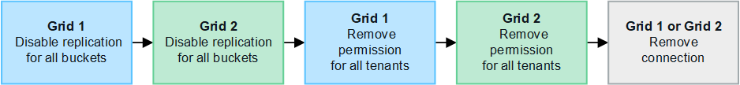

= Gérer les connexions de fédération de grille
:allow-uri-read: 
:icons: font
:imagesdir: ../media/

[role="lead"]
La gestion des connexions de fédération de grille entre les systèmes StorageGRID inclut la modification des détails de connexion, la rotation des certificats, la suppression des autorisations de locataire et la suppression des connexions inutilisées.

.Avant de commencer
* Vous êtes connecté au Gestionnaire de grille sur l'une des grilles à l'aide d'un link:../admin/web-browser-requirements.html["navigateur web pris en charge"].
* Vous avez le link:admin-group-permissions.html["Autorisation d'accès racine"] pour la grille à laquelle vous êtes connecté.

== [[edit_grid_fed_connection]]modifiez une connexion de fédération de grille

Vous pouvez modifier une connexion de fédération de grille en vous connectant au nœud d'administration principal sur l'une des grilles de la connexion. Après avoir apporté des modifications à la première grille, vous devez télécharger un nouveau fichier de vérification et le télécharger sur l'autre grille.

NOTE: Pendant la modification de la connexion, les demandes de réplication de clone de compte ou de grille croisée continueront à utiliser les paramètres de connexion existants. Toutes les modifications apportées à la première grille sont enregistrées localement, mais ne sont utilisées qu'après avoir été téléchargées sur la deuxième grille, enregistrées et testées.

=== Commencez à modifier la connexion

.Étapes
. Connectez-vous au Grid Manager à partir du nœud d'administration principal de l'une des grilles.
. Sélectionnez *Nœuds* et confirmez que tous les autres nœuds d’administration de votre système sont en ligne.
+

NOTE: Lorsque vous modifiez une connexion de fédération de grille, StorageGRID tente d'enregistrer un fichier de configuration de candidat sur tous les nœuds d'administration de la première grille. Si ce fichier ne peut pas être enregistré sur tous les nœuds d'administration, un message d'avertissement s'affiche lorsque vous sélectionnez *Enregistrer et tester*.

. Sélectionnez *Configuration* > *Système* > *Fédération de grille*.
. Modifiez les détails de la connexion à l'aide du menu *actions* de la page de fédération de la grille ou de la page de détails d'une connexion spécifique. Reportez-vous  à la section link:grid-federation-create-connection.html["Créer des connexions de fédération de grille"] pour savoir ce que vous devez saisir.
+
[role="tabbed-block"]
====
.Menu actions
--
.. Sélectionnez le bouton radio de la connexion.
.. Sélectionnez *actions* > *Modifier*.
.. Entrez les nouvelles informations.

--
.Page de détails
--
.. Sélectionnez un nom de connexion pour afficher ses détails.
.. Sélectionnez *Modifier*.
.. Entrez les nouvelles informations.

--
====
. Saisissez la phrase de passe de provisionnement pour la grille à laquelle vous êtes connecté.
. Sélectionnez *Enregistrer et continuer*.
+
Les nouvelles valeurs sont enregistrées, mais elles ne seront pas appliquées à la connexion tant que vous n'aurez pas téléchargé le nouveau fichier de vérification sur l'autre grille.

. Sélectionnez *Télécharger le fichier de vérification*.
+
Pour télécharger ce fichier ultérieurement, rendez-vous sur la page de détails de la connexion.

. Localisez le fichier téléchargé (`_connection-name_.grid-federation`) et enregistrez-le dans un emplacement sûr.
+

CAUTION: Le fichier de vérification contient des secrets et doit être stocké et transmis en toute sécurité.

. Sélectionnez *Fermer* pour revenir à la page de fédération de grille.
. Vérifiez que l'état de la *connexion* est *en attente de modification*.
+

NOTE: Si l'état de la connexion était autre que *connecté* lorsque vous avez commencé à modifier la connexion, il ne passera pas à *modification en attente*.

. Fournissez le `_connection-name_.grid-federation` fichier à l'administrateur de grille pour l'autre grille.

=== Terminer la modification de la connexion

Terminez la modification de la connexion en téléchargeant le fichier de vérification sur l'autre grille.

.Étapes
. Connectez-vous au Grid Manager à partir du nœud d'administration principal.
. Sélectionnez *Configuration* > *Système* > *Fédération de grille*.
. Sélectionnez *Télécharger le fichier de vérification* pour accéder à la page de téléchargement.
. Sélectionnez *Télécharger le fichier de vérification*. Ensuite, recherchez et sélectionnez le fichier téléchargé à partir de la première grille.
. Saisissez la phrase de passe de provisionnement pour la grille à laquelle vous êtes actuellement connecté.
. Sélectionnez *Enregistrer et tester*.
+
Si la connexion peut être établie à l'aide des valeurs modifiées, un message de réussite s'affiche. Sinon, un message d'erreur s'affiche. Passez en revue le message et répondez à tout problème.

. Fermez l'assistant pour revenir à la page de fédération de grille.
. Vérifiez que l'état de la *connexion* est *connecté*.
. Accédez à la page grid federation sur la première grille et actualisez le navigateur. Vérifiez que l'état de la *connexion* est maintenant *connecté*.
. Une fois la connexion établie, supprimez de manière sécurisée toutes les copies du fichier de vérification.

== [[test_GRID_fed_connection]]Tester une connexion de fédération de grille

.Étapes
. Connectez-vous au Grid Manager à partir du nœud d'administration principal.
. Sélectionnez *Configuration* > *Système* > *Fédération de grille*.
. Testez la connexion à l'aide du menu *actions* de la page de fédération de la grille ou de la page de détails d'une connexion spécifique.
+
[role="tabbed-block"]
====
.Menu actions
--
.. Sélectionnez le bouton radio de la connexion.
.. Sélectionnez *actions* > *Test*.

--
.Page de détails
--
.. Sélectionnez un nom de connexion pour afficher ses détails.
.. Sélectionnez *Tester la connexion*.

--
====
. Vérifiez l'état de la connexion :
+
[cols="1a,2a"]
|===
| État de la connexion | Description 

 a| 
Connecté
 a| 
Les deux grilles sont connectées et communiquent normalement.

 a| 
Erreur
 a| 
La connexion est en état d'erreur. Par exemple, un certificat a expiré ou une valeur de configuration n'est plus valide.

 a| 
Modification en attente
 a| 
Vous avez modifié la connexion sur cette grille, mais la connexion utilise toujours la configuration existante. Pour terminer la modification, téléchargez le nouveau fichier de vérification sur l'autre grille.

 a| 
En attente de connexion
 a| 
Vous avez configuré la connexion sur cette grille, mais la connexion n'a pas été effectuée sur l'autre grille. Téléchargez le fichier de vérification à partir de cette grille et téléchargez-le sur l'autre grille.

 a| 
Inconnu
 a| 
La connexion est dans un état inconnu, probablement en raison d'un problème de mise en réseau ou d'un nœud hors ligne.

|===
. Si l'état de la connexion est *Error*, résolvez les problèmes éventuels. Ensuite, sélectionnez de nouveau *Tester la connexion* pour confirmer que le problème a été résolu.

== [[rotate_grid_fed_certificates]]faire pivoter les certificats de connexion

Chaque connexion de fédération de grille utilise quatre certificats SSL générés automatiquement pour sécuriser la connexion. Lorsque les deux certificats de chaque grille sont proches de leur date d'expiration, l'alerte *expiration du certificat de fédération GRID* vous rappelle de faire pivoter les certificats.

CAUTION: Si les certificats à l'une des extrémités de la connexion expirent, la connexion cesse de fonctionner et les réplications sont en attente jusqu'à ce que les certificats soient mis à jour.

.Étapes
. Connectez-vous au Grid Manager à partir du nœud d'administration principal de l'une des grilles.
. Sélectionnez *Configuration* > *Système* > *Fédération de grille*.
. Dans l'un des onglets de la page fédération de grille, sélectionnez le nom de la connexion pour afficher ses détails.
. Sélectionnez l'onglet *certificats*.
. Sélectionnez *faire pivoter les certificats*.
. Spécifiez le nombre de jours pendant lesquels les nouveaux certificats doivent être valides.
. Saisissez la phrase de passe de provisionnement pour la grille à laquelle vous êtes connecté.
. Sélectionnez *faire pivoter les certificats*.
. Si nécessaire, répétez ces étapes sur l'autre grille de la connexion.
+
En général, utilisez le même nombre de jours pour les certificats des deux côtés de la connexion.

== [[remove_grid_fed_connection]]supprime une connexion de fédération de grille

Vous pouvez supprimer une connexion de fédération de grille de l'une des grilles de la connexion. Comme indiqué dans la figure, vous devez effectuer les étapes préalables sur les deux grilles pour confirmer que la connexion n'est pas utilisée par un locataire sur l'une ou l'autre des grilles.

Avant de supprimer une connexion, notez les points suivants :

* La suppression d'une connexion ne supprime pas les éléments qui ont déjà été copiés entre les grilles. Par exemple, les utilisateurs de tenant, les groupes et les objets qui existent sur les deux grilles ne sont pas supprimés de l'une ou l'autre de ces grilles lorsque l'autorisation du tenant est supprimée. Si vous souhaitez supprimer ces éléments, vous devez les supprimer manuellement des deux grilles.
* Lorsque vous supprimez une connexion, la réplication de tous les objets en attente de réplication (ingérés mais pas encore répliqués sur l'autre grille) échouera définitivement.

=== Désactivez la réplication pour tous les compartiments de locataires

.Étapes
. À partir de l'une des grilles, connectez-vous au Gestionnaire de grille à partir du nœud d'administration principal.
. Sélectionnez *Configuration* > *Système* > *Fédération de grille*.
. Sélectionnez le nom de la connexion pour afficher ses détails.
. Dans l'onglet *locataires autorisés*, déterminez si la connexion est utilisée par un locataire.
. Si des locataires sont répertoriés, demandez à tous les locataires de link:../tenant/grid-federation-manage-cross-grid-replication.html["désactiver la réplication entre les grilles"] pour tous leurs compartiments sur les deux grilles de la connexion.
+

TIP: Vous ne pouvez pas supprimer l'autorisation *utiliser la connexion de fédération de grille* si une réplication de type cross-grid est activée dans des compartiments de tenant. Chaque compte de locataire doit désactiver la réplication inter-grid pour ses compartiments sur les deux grilles.

=== Supprimer l'autorisation pour chaque locataire

Une fois la réplication multigrille désactivée pour tous les compartiments de tenant, supprimez l'autorisation *utiliser la fédération de grid* de tous les locataires sur les deux grilles.

.Étapes
. Sélectionnez *Configuration* > *Système* > *Fédération de grille*.
. Sélectionnez le nom de la connexion pour afficher ses détails.
. Pour chaque locataire de l'onglet *locataires autorisés*, supprimez l'autorisation *utiliser la connexion de fédération de grille* de chaque locataire. Voir link:grid-federation-manage-tenants.html["Gérer les locataires autorisés"].
. Répétez ces étapes pour les locataires autorisés sur l'autre grille.

=== Déposer la connexion

.Étapes
. Lorsqu'aucun locataire de l'une ou l'autre grille n'utilise la connexion, sélectionnez *Supprimer*.
. Vérifiez le message de confirmation et sélectionnez *Supprimer*.
+
** Si la connexion peut être supprimée, un message de réussite s'affiche. La connexion de fédération de grille est maintenant supprimée des deux grilles.
** Si la connexion ne peut pas être supprimée (par exemple, elle est toujours en cours d'utilisation ou si une erreur de connexion s'est produite), un message d'erreur s'affiche. Vous pouvez effectuer l'une des opérations suivantes :
+
*** Résolvez l'erreur (recommandé). Voir link:grid-federation-troubleshoot.html["Dépanner les erreurs de fédération de grille"].
*** Déposer la connexion par la force. Voir la section suivante.

== [[force-remove_grid_fed_connection]]supprime une connexion de fédération de grille par force

Si nécessaire, vous pouvez forcer la suppression d'une connexion qui n'a pas l'état *Connected*.

La suppression forcée supprime uniquement la connexion de la grille locale. Pour supprimer complètement la connexion, effectuez les mêmes étapes sur les deux grilles.

.Étapes
. Dans la boîte de dialogue de confirmation, sélectionnez *forcer la suppression*.
+
Un message de réussite s'affiche. Cette connexion de fédération de grille ne peut plus être utilisée. Cependant, la réplication entre les compartiments de locataires peut toujours être activée et certaines copies d'objet peuvent avoir déjà été répliquées entre les grilles dans la connexion.

. À partir de l'autre grille de la connexion, connectez-vous au Gestionnaire de grille à partir du nœud d'administration principal.
. Sélectionnez *Configuration* > *Système* > *Fédération de grille*.
. Sélectionnez le nom de la connexion pour afficher ses détails.
. Sélectionnez *Supprimer* et *Oui*.
. Sélectionnez *forcer la suppression* pour supprimer la connexion de cette grille.

