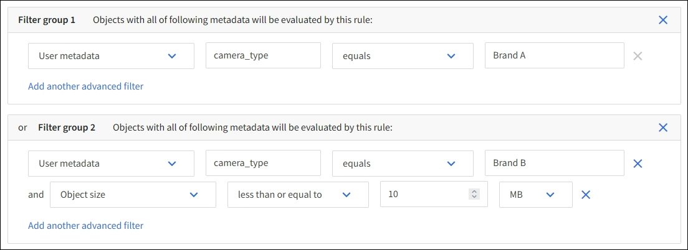

= Étape 1 sur 3 : saisissez les détails
:allow-uri-read: 
:icons: font
:imagesdir: ../media/

[role="lead"]
L'étape *entrer détails* de l'assistant Créer une règle ILM vous permet d'entrer un nom et une description pour la règle et de définir des filtres pour la règle.

La saisie d'une description et la définition de filtres pour la règle sont facultatives.

.Description de la tâche
Lors de l'évaluation d'un objet link:what-ilm-rule-is.html["Règle ILM"]par rapport à un , StorageGRID compare les métadonnées de l'objet aux filtres de la règle. Si les métadonnées correspondent à tous les filtres, StorageGRID utilise la règle pour placer l'objet. Vous pouvez concevoir une règle à appliquer à tous les objets, ou spécifier des filtres de base, tels qu'un ou plusieurs comptes de locataire, noms de compartiment ou filtres avancés, tels que la taille de l'objet ou les métadonnées utilisateur.

.Étapes
. Entrez un nom unique pour la règle dans le champ *Nom*.
. Vous pouvez également saisir une brève description de la règle dans le champ *Description*.
+
Vous devez décrire le but ou la fonction de la règle afin de pouvoir reconnaître la règle ultérieurement.

. Vous pouvez également sélectionner un ou plusieurs comptes de locataire S3 auxquels cette règle s'applique. Si cette règle s'applique à tous les locataires, laissez ce champ vide.
+
Si vous ne disposez pas de l'autorisation d'accès racine ou de compte de locataire, vous ne pouvez pas sélectionner de locataires dans la liste. Entrez plutôt l'ID de tenant ou entrez plusieurs ID comme une chaîne délimitée par des virgules.

. Vous pouvez également spécifier les compartiments S3 auxquels cette règle s'applique.
+
Si *s'applique à tous les compartiments* est sélectionné (par défaut), la règle s'applique à tous les compartiments S3.

. Pour les locataires S3, sélectionnez *Oui* pour appliquer la règle uniquement aux anciennes versions d'objets dans des compartiments S3 pour lesquels la gestion de versions est activée.
+
Si vous sélectionnez *Oui*, "Noncurrent Time" sera automatiquement sélectionné pour l'heure de référence dans link:create-ilm-rule-define-placements.html["Étape 2 de l'assistant de création de règles ILM"].

+

NOTE: Une heure non actuelle s'applique uniquement aux objets S3 dans des compartiments avec gestion des versions. Voir link:../s3/operations-on-buckets.html["Opérations sur les godets, PutBucketVersioning"] et link:managing-objects-with-s3-object-lock.html["Gestion des objets avec le verrouillage d'objets S3"].

+
Vous pouvez utiliser cette option pour réduire l'impact du stockage des objets multiversion en filtrant pour les versions d'objets non à jour. Voir link:example-4-ilm-rules-and-policy-for-s3-versioned-objects.html["Exemple 4 : règles et règles ILM pour les objets avec version S3"].

. Si vous le souhaitez, sélectionnez *Ajouter un filtre avancé* pour spécifier des filtres supplémentaires.
+
Si vous ne configurez pas le filtrage avancé, la règle s'applique à tous les objets correspondant aux filtres de base. Pour plus d'informations sur le filtrage avancé, reportez-vous aux sections <<Utilisation de filtres avancés dans les règles ILM>> et <<Spécifiez plusieurs types et valeurs de métadonnées>>.

. Sélectionnez *Continuer*. link:create-ilm-rule-define-placements.html["Étape 2 (définir les placements)"] De l'assistant de création d'une règle ILM s'affiche.

== Utilisation de filtres avancés dans les règles ILM

Le filtrage avancé vous permet de créer des règles ILM qui s'appliquent uniquement à des objets spécifiques en fonction de leurs métadonnées. Lorsque vous configurez le filtrage avancé d'une règle, vous sélectionnez le type de métadonnées que vous souhaitez associer, sélectionnez un opérateur et spécifiez une valeur de métadonnées. Lors de l'évaluation des objets, la règle ILM s'applique uniquement aux objets dont les métadonnées correspondent au filtre avancé.

Le tableau indique les types de métadonnées que vous pouvez spécifier dans les filtres avancés, les opérateurs que vous pouvez utiliser pour chaque type de métadonnées et les valeurs de métadonnées attendues.

[cols="1a,1a,2a"]
|===
| Type de métadonnées | Opérateurs pris en charge | Valeur des métadonnées 

 a| 
Temps d'ingestion
 a| 
* est
* n'est pas
* est avant
* est activé ou avant
* est après
* est activé ou après

 a| 
Heure et date d'ingestion de l'objet.

*Remarque :* pour éviter les problèmes de ressources lors de l'activation d'une nouvelle stratégie ILM, vous pouvez utiliser le filtre avancé heure d'ingestion dans toute règle susceptible de modifier l'emplacement d'un grand nombre d'objets existants. Définissez le temps d'ingestion sur une valeur supérieure ou égale à la durée approximative de l'entrée en vigueur de la nouvelle règle pour vous assurer que les objets existants ne sont pas déplacés inutilement.

 a| 
Clé
 a| 
* égal à
* n'est pas égal
* contient
* ne contient pas
* commence par
* ne commence pas par
* se termine par
* ne se termine pas par

 a| 
Tout ou partie d'une clé d'objet S3 unique.

Par exemple, vous pouvez souhaiter faire correspondre des objets qui se terminent `.txt` par ou commencent par `test-object/`.

 a| 
Heure du dernier accès
 a| 
* est
* n'est pas
* est avant
* est activé ou avant
* est après
* est activé ou après

 a| 
Heure et date de la dernière récupération de l'objet (lecture ou visualisation).

*Remarque :* si vous prévoyez d'link:using-last-access-time-in-ilm-rules.html["utiliser l'heure du dernier accès"]utiliser un filtre avancé, les mises à jour de l'heure du dernier accès doivent être activées pour le compartiment S3.

 a| 
Contrainte d'emplacement (S3 uniquement)
 a| 
* égal à
* n'est pas égal

 a| 
Région dans laquelle un compartiment S3 a été créé. Utilisez *ILM* > *régions* pour définir les régions affichées.

*Remarque :* une valeur us-east-1 correspondra aux objets dans les buckets créés dans la région us-east-1 ainsi qu'aux objets dans les buckets qui n'ont aucune région spécifiée. Voir link:configuring-regions-optional-and-s3-only.html["Configurer les régions S3"] .

 a| 
Taille de l'objet
 a| 
* égal à
* n'est pas égal
* inférieur à
* inférieur ou égal à
* supérieur à
* supérieur ou égal à

 a| 
Taille de l'objet.

Le codage d'effacement convient mieux aux objets de plus de 1 Mo. N'utilisez pas le code d'effacement pour les objets inférieurs à 200 Ko afin d'éviter la surcharge liée à la gestion de très petits fragments de code d'effacement.

 a| 
Métadonnées d'utilisateur
 a| 
* contient
* se termine par
* égal à
* existe
* commence par
* ne contient pas
* ne se termine pas par
* n'est pas égal
* n'existe pas
* ne commence pas par

 a| 
Paire clé-valeur, où *Nom métadonnées utilisateur* est la clé et *valeur métadonnées* la valeur.

Par exemple, pour filtrer les objets qui ont des métadonnées utilisateur de `color=blue`, spécifiez `color` *Nom de métadonnées utilisateur*, `equals` pour l'opérateur et `blue` *valeur de métadonnées*.

*Remarque :* les noms de métadonnées de l'utilisateur ne sont pas sensibles à la casse; les valeurs de métadonnées de l'utilisateur sont sensibles à la casse.

 a| 
Balise objet (S3 uniquement)
 a| 
* contient
* se termine par
* égal à
* existe
* commence par
* ne contient pas
* ne se termine pas par
* n'est pas égal
* n'existe pas
* ne commence pas par

 a| 
Paire clé-valeur, où *Nom balise objet* est la clé et *valeur balise objet* est la valeur.

Par exemple, pour filtrer sur des objets dont la balise d'objet est `Image=True`, spécifiez `Image` *Nom de la balise d'objet*, `equals` pour l'opérateur et `True` pour *valeur de la balise d'objet*.

*Remarque :* les noms de balise d'objet et les valeurs de balise d'objet sont sensibles à la casse. Vous devez entrer ces éléments exactement comme ils ont été définis pour l'objet.

|===

== Spécifiez plusieurs types et valeurs de métadonnées

Lorsque vous définissez le filtrage avancé, vous pouvez spécifier plusieurs types de métadonnées et plusieurs valeurs de métadonnées. Par exemple, si vous souhaitez qu'une règle corresponde à des objets d'une taille comprise entre 10 Mo et 100 Mo, vous devez sélectionner le type de métadonnées *Object size* et spécifier deux valeurs de métadonnées.

* La première valeur de métadonnées spécifie des objets supérieurs ou égaux à 10 Mo.
* La seconde valeur de métadonnées spécifie des objets inférieurs ou égaux à 100 Mo.

image::../media/advanced_filtering_size_between.png[Exemple de filtrage avancé pour la taille d'objet]

L'utilisation de plusieurs entrées vous permet d'avoir un contrôle précis sur les objets à associer. Dans l'exemple suivant, la règle s'applique aux objets dont la marque A ou la marque B est la valeur des métadonnées de l'utilisateur camera_type. Toutefois, la règle s'applique uniquement aux objets de marque B dont la taille est inférieure à 10 Mo.

