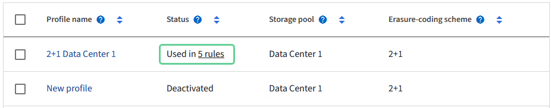

= Gestion des profils de code d'effacement
:allow-uri-read: 
:icons: font
:imagesdir: ../media/

[role="lead"]
Vous pouvez afficher les détails d'un profil de code d'effacement et renommer un profil si nécessaire. Vous pouvez désactiver un profil de code d'effacement s'il n'est actuellement utilisé dans aucune règle ILM.

.Avant de commencer
* Vous êtes connecté au Gestionnaire de grille à l'aide d'un link:../admin/web-browser-requirements.html["navigateur web pris en charge"].
* Vous avez le link:../admin/admin-group-permissions.html["autorisations d'accès requises"].

== Afficher les détails du profil de code d'effacement

Vous pouvez afficher les détails d'un profil de code d'effacement pour déterminer son état, le schéma de code d'effacement utilisé et d'autres informations.

.Étapes
. Sélectionnez *Configuration* > *Système* > *Codage d'effacement*.
. Sélectionnez le profil. La page de détails du profil s'affiche.
. Vous pouvez également afficher l'onglet règles ILM pour obtenir la liste des règles ILM qui utilisent le profil, ainsi que les règles ILM qui les utilisent.
. Vous pouvez également afficher l'onglet nœuds de stockage pour plus de détails sur chaque nœud de stockage du pool de stockage du profil, par exemple le site où il se trouve et l'utilisation du stockage.

== Renommer un profil de code d'effacement

Vous pouvez renommer un profil de code d'effacement pour le rendre plus évident.

.Étapes
. Sélectionnez *Configuration* > *Système* > *Codage d'effacement*.
. Sélectionnez le profil à renommer.
. Sélectionnez *Renommer*.
. Entrez un nom unique pour le profil de code d'effacement.
+
Le nom du profil de code d'effacement est ajouté au nom du pool de stockage dans l'instruction de placement d'une règle ILM.

+

NOTE: Les noms des profils de code d'effacement doivent être uniques. Une erreur de validation se produit si vous utilisez le nom d'un profil existant, même si ce profil a été désactivé.

. Sélectionnez *Enregistrer*.

== Désactiver un profil de code d'effacement

Vous pouvez désactiver un profil de code d'effacement si vous ne prévoyez plus de l'utiliser et si ce profil n'est pas utilisé dans les règles ILM.

TIP: Vérifier qu'aucune réparation de données avec code d'effacement ou procédure de désaffectation n'est en cours. Un message d'erreur s'affiche si vous tentez de désactiver un profil de code d'effacement alors que l'une de ces opérations est en cours.

.Description de la tâche
StorageGRID vous empêche de désactiver un profil de code d'effacement si l'une des conditions suivantes est vraie :

* Le profil de code d'effacement est actuellement utilisé dans une règle ILM.
* Le profil de code d'effacement n'est plus utilisé dans les règles ILM, mais les données en objet et les fragments de parité du profil existent toujours.

.Étapes
. Sélectionnez *Configuration* > *Système* > *Codage d'effacement*.
. Dans l'onglet actif, consultez la colonne *Status* pour confirmer que le profil de code d'effacement que vous souhaitez désactiver n'est utilisé dans aucune règle ILM.
+
Vous ne pouvez pas désactiver un profil de code d'effacement s'il est utilisé dans une règle ILM. Dans cet exemple, le profil Data Center 1 2+1 est utilisé dans au moins une règle ILM.

+

. Si le profil est utilisé dans une règle ILM, effectuez la procédure suivante :
+
.. Sélectionnez *ILM* > *règles*.
.. Sélectionnez chaque règle et consultez le diagramme de rétention pour déterminer si la règle utilise le profil de code d'effacement que vous souhaitez désactiver.
.. Si la règle ILM utilise le profil de code d'effacement que vous souhaitez désactiver, déterminez si cette règle est utilisée dans une règle ILM.
.. Complétez les étapes supplémentaires du tableau, en fonction de l'endroit où le profil de code d'effacement est utilisé.
+
[cols="2a,4a,1a"]
|===
| Où le profil a-t-il été utilisé ? | Étapes supplémentaires à effectuer avant la désactivation du profil | Reportez-vous à ces instructions supplémentaires 

 a| 
Jamais utilisé dans une règle ILM
 a| 
Aucune étape supplémentaire n'est requise. Poursuivre cette procédure.
 a| 
_Aucun_

 a| 
Les règles ILM n'ont jamais été utilisées dans toutes les règles ILM
 a| 
... Modifiez ou supprimez toutes les règles ILM affectées. Si vous modifiez la règle, supprimez tous les placements qui utilisent le profil de code d'effacement.
... Poursuivre cette procédure.

 a| 
link:working-with-ilm-rules-and-ilm-policies.html["Utilisation des règles ILM et des règles ILM"]

 a| 
Règle ILM actuellement dans une règle ILM active
 a| 
... Cloner la règle.
... Suppression de la règle ILM utilisant le profil de code d'effacement
... Ajoutez une ou plusieurs nouvelles règles ILM pour assurer la protection des objets.
... Enregistrez, simulez et activez la nouvelle stratégie.
... Attendez que la nouvelle stratégie soit appliquée et que les objets existants soient déplacés vers de nouveaux emplacements en fonction des nouvelles règles que vous avez ajoutées.
+
*Remarque :* en fonction du nombre d'objets et de la taille de votre système StorageGRID, le déplacement des objets vers de nouveaux emplacements peut prendre des semaines, voire des mois, en fonction des nouvelles règles ILM.

+
Bien que vous puissiez tenter en toute sécurité de désactiver un profil de code d'effacement alors qu'il est toujours associé à des données, l'opération de désactivation échoue. Un message d'erreur vous informe si le profil n'est pas encore prêt à être désactivé.

... Modifiez ou supprimez la règle que vous avez supprimée de la stratégie. Si vous modifiez la règle, supprimez tous les placements qui utilisent le profil de code d'effacement.
... Poursuivre cette procédure.

 a| 
link:creating-ilm-policy.html["Créer une règle ILM"]

link:working-with-ilm-rules-and-ilm-policies.html["Utilisation des règles ILM et des règles ILM"]

 a| 
Dans une règle ILM actuellement dans une politique ILM
 a| 
... Modifiez la stratégie.
... Suppression de la règle ILM utilisant le profil de code d'effacement
... Ajoutez une ou plusieurs nouvelles règles ILM pour protéger tous les objets.
... Enregistrez la stratégie.
... Modifiez ou supprimez la règle que vous avez supprimée de la stratégie. Si vous modifiez la règle, supprimez tous les placements qui utilisent le profil de code d'effacement.
... Poursuivre cette procédure.

 a| 
link:creating-ilm-policy.html["Créer une règle ILM"]

link:working-with-ilm-rules-and-ilm-policies.html["Utilisation des règles ILM et des règles ILM"]

|===
.. Actualisez la page Erasure-Coding Profiles pour vous assurer que le profil n'est pas utilisé dans une règle ILM.

. Si le profil n'est pas utilisé dans une règle ILM, sélectionnez le bouton radio et sélectionnez *Désactiver*. La boîte de dialogue Désactiver le profil de code d'effacement s'affiche.
+

TIP: Vous pouvez sélectionner plusieurs profils à désactiver en même temps, tant que chaque profil n'est utilisé dans aucune règle.

. Si vous êtes sûr de vouloir désactiver le profil, sélectionnez *Désactiver*.

.Résultats
* Si StorageGRID peut désactiver le profil de code d'effacement, son état est désactivé. Vous ne pouvez plus sélectionner ce profil pour une règle ILM. Vous ne pouvez pas réactiver un profil désactivé.
* Si StorageGRID ne peut pas désactiver le profil, un message d'erreur s'affiche. Par exemple, un message d'erreur s'affiche si les données d'objet sont toujours associées à ce profil. Vous devrez peut-être attendre plusieurs semaines avant d'essayer à nouveau le processus de désactivation.

