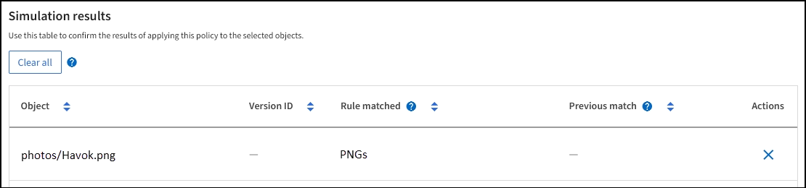

= Exemples de simulations de règles ILM
:allow-uri-read: 
:icons: font
:imagesdir: ../media/

[role="lead"]
Les exemples de simulations de règles ILM fournissent des instructions pour structurer et modifier des simulations pour votre environnement.

== Exemple 1 : vérification des règles lors de la simulation d'une règle ILM

Cet exemple décrit comment vérifier des règles lors de la simulation d'une stratégie.

Dans cet exemple, la *exemple de règle ILM* est simulée contre les objets ingérés dans deux compartiments. La politique comprend trois règles, comme suit :

* La première règle, *deux copies, deux ans pour le compartiment a*, ne s'applique qu'aux objets du compartiment a.
* La deuxième règle, *objets EC > 1 Mo*, s'applique à tous les compartiments, mais aux filtres sur des objets supérieurs à 1 Mo.
* La troisième règle, *deux copies, deux centres de données*, est la règle par défaut. Il n'inclut aucun filtre et n'utilise pas l'heure de référence non actuelle.

Après avoir simulé la règle, confirmez que chaque objet a été mis en correspondance avec la règle appropriée.

image::../media/simulate_policy_screen.png[Simuler les résultats de la règle]

Dans cet exemple :

* `bucket-a/bucket-a object.pdf` correspond correctement à la première règle, qui filtre les objets dans `bucket-a`.
* `bucket-b/test object greater than 1 MB.pdf` est dans `bucket-b`, donc il ne correspond pas à la première règle. Au lieu de cela, il a été correctement mis en correspondance par la deuxième règle, qui filtre les objets de plus de 1 Mo.
* `bucket-b/test object less than 1 MB.pdf` ne correspondant pas aux filtres des deux premières règles, il sera donc placé par la règle par défaut, qui n'inclut pas de filtres.

== Exemple 2 : réorganisation des règles lors de la simulation d'une politique ILM

Cet exemple montre comment vous pouvez réorganiser les règles pour modifier les résultats lors de la simulation d'une règle.

Dans cet exemple, la politique *Demo* est en cours de simulation. Cette règle, qui vise à trouver des objets qui ont des métadonnées utilisateur série=x-men, comprend trois règles, comme suit :

* La première règle, *PNgs*, filtre les noms de clés qui se terminent par `.png`.
* La deuxième règle, *X-MEN*, ne s'applique qu'aux objets pour tenant A et aux filtres pour les `series=x-men` métadonnées utilisateur.
* La dernière règle, *deux copies deux centres de données*, est la règle par défaut, qui correspond à tous les objets qui ne correspondent pas aux deux premières règles.

.Étapes
. Après avoir ajouté les règles et enregistré la stratégie, sélectionnez *Simulate*.
. Dans le champ *Object*, entrez le compartiment S3/clé-objet pour un objet test et sélectionnez *Simulate*.
+
Les résultats de la simulation s'affichent, indiquant que l' `Havok.png`objet a été mis en correspondance avec la règle *PNgs*.

+

+
Cependant, `Havok.png` était destiné à tester la règle *X-MEN*.

. Pour résoudre le problème, réorganisez les règles.
+
.. Sélectionnez *Terminer* pour fermer la fenêtre simuler une politique ILM.
.. Sélectionnez *Modifier* pour modifier la stratégie.
.. Faites glisser la règle *X-men* en haut de la liste.
.. Sélectionnez *Enregistrer*.

. Sélectionnez *simuler*.
+
Les objets que vous avez testés précédemment sont réévalués par rapport à la règle mise à jour et les nouveaux résultats de simulation sont affichés. Dans l'exemple, la colonne correspondance de règle indique que l' `Havok.png`objet correspond désormais à la règle de métadonnées X-MEN, comme prévu. La colonne comparaison précédente indique que la règle des PNG correspond à l'objet dans la simulation précédente.

+
image::../media/simulate_reorder_rules_correct_result.png[Exemple 2 : réorganisation des règles lors de la simulation d'une politique ILM]

== Exemple 3 : correction d'une règle lors de la simulation d'une règle ILM

Cet exemple montre comment simuler une stratégie, corriger une règle dans la règle et poursuivre la simulation.

Dans cet exemple, la politique *Demo* est en cours de simulation. Cette règle a pour but de rechercher des objets qui ont des `series=x-men` métadonnées utilisateur. Cependant, des résultats inattendus se sont produits lors de la simulation de cette règle par rapport à l' `Beast.jpg`objet. Au lieu de faire correspondre la règle de métadonnées X-Men, l'objet correspond à la règle par défaut, deux copies de deux centres de données.

image::../media/simulate_results_for_object_wrong_metadata.png[Exemple 3 : correction d'une règle lors de la simulation d'une règle ILM]

Lorsqu'un objet test n'est pas associé à la règle attendue de la stratégie, vous devez examiner chaque règle de la stratégie et corriger les erreurs éventuelles.

.Étapes
. Sélectionnez *Terminer* pour fermer la boîte de dialogue simuler la stratégie. Sur la page de détails de la stratégie, sélectionnez *diagramme de rétention*. Sélectionnez ensuite *développer tout* ou *Afficher les détails* pour chaque règle selon les besoins.
. Vérifiez le compte de locataire de la règle, l'heure de référence et les critères de filtrage.
+
Supposons, par exemple, que les métadonnées de la règle X-MEN aient été saisies comme "x-men01" au lieu de "x-MEN".

. Pour résoudre l'erreur, corrigez la règle comme suit :
+
** Si la règle fait partie de la règle, vous pouvez la cloner ou la supprimer de la règle, puis la modifier.
** Si la règle fait partie de la stratégie active, vous devez cloner la règle. Vous ne pouvez pas modifier ou supprimer une règle de la stratégie active.

. Exécuter à nouveau la simulation.
+
Dans cet exemple, la règle X-MEN corrigée correspond désormais à l' `Beast.jpg`objet en fonction des `series=x-men` métadonnées de l'utilisateur, comme prévu.

+
image::../media/simulate_results_for_object_corrected_metadata.png[Exemple 3 : correction d'une règle lors de la simulation d'une règle ILM]

