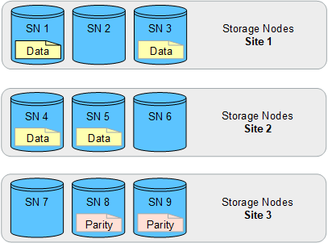

= Activer la protection contre la perte de site
:allow-uri-read: 
:icons: font
:imagesdir: ../media/

[role="lead"]
Si votre déploiement StorageGRID inclut plusieurs sites, vous pouvez utiliser la réplication et le code d'effacement avec des pools de stockage configurés de manière appropriée pour assurer la protection contre la perte de site.

Le code d'effacement et la réplication nécessitent différentes configurations de pools de stockage :

* Pour utiliser la réplication pour la protection contre les pertes sur site, utilisez les pools de stockage spécifiques au site qui sont automatiquement créés lors de l'installation de StorageGRID. Créez ensuite des règles ILM link:create-ilm-rule-define-placements.html["instructions de positionnement"]spécifiant plusieurs pools de stockage afin qu'une copie de chaque objet soit placée sur chaque site.
* Pour utiliser le code d'effacement pour la protection contre les pertes de site, link:guidelines-for-creating-storage-pools.html#guidelines-for-storage-pools-used-for-erasure-coded-copies["créez des pools de stockage composés de plusieurs sites"]. Ensuite, créez des règles ILM qui utilisent un pool de stockage composé de plusieurs sites et n'importe quel schéma de code d'effacement disponible.

CAUTION: Lors de la configuration de votre déploiement StorageGRID pour la protection contre les pertes de site, vous devez également prendre en compte les effets link:data-protection-options-for-ingest.html["options d'ingestion"]de et link:../s3/consistency-controls.html["la cohérence"].

== Exemple de réplication

Par défaut, un pool de stockage est créé pour chaque site lors de l'installation de StorageGRID. Avec des pools de stockage composés d'un seul site, vous pouvez configurer des règles ILM qui utilisent la réplication pour la protection contre la perte de site. Dans cet exemple :

* Le pool de stockage 1 contient le site 1
* Le pool de stockage 2 contient le site 2
* La règle ILM contient deux emplacements :
+
** Stocker les objets en répliquant 1 copie sur le site 1
** Stockez les objets en répliquant 1 copie sur le site 2

Placement des règles ILM :

image::../media/ilm_replication_at_2_sites.png[Réplication d'une copie sur deux sites]

image::../media/ilm_replication_make_2_copies_2_pools_2_sites.png[Faites 1 copie sur chacun des 2 sites - pool de stockage spécifique au site]

Si un site est perdu, des copies des objets sont disponibles sur l'autre site.

== Exemple de code d'effacement

Les pools de stockage comprenant plusieurs sites par pool de stockage vous permettent de configurer des règles ILM qui utilisent le code d'effacement pour la protection contre la perte de site. Dans cet exemple :

* Le pool de stockage 1 contient les sites 1 à 3
* La règle ILM contient un emplacement : stockage des objets par code d'effacement à l'aide d'un schéma EC 4+2 au niveau du pool de stockage 1, qui contient trois sites

Placement des règles ILM :

image::../media/ilm_erasure_coding_site_loss_protection_4+2.png[Pool de stockage EC 1 9 nœuds de stockage 3 sites]

Dans cet exemple :

* La règle ILM utilise un schéma de code d'effacement 4+2.
* Chaque objet est tranché en quatre fragments de données égaux et deux fragments de parité sont calculés à partir des données d'objet.
* Chacun des six fragments est stocké sur un nœud différent sur trois sites du data Center pour assurer la protection des données en cas de défaillance d'un nœud ou de perte d'un site.

NOTE: Le code d'effacement est autorisé dans les pools de stockage contenant un nombre quelconque de sites _excepté_ deux sites.

Règle ILM basée sur un schéma de code d'effacement 4+2 :

En cas de perte d'un site, les données peuvent toujours être restaurées :

image::../media/ec_three_sites_4_plus_2_site_loss_example.png[Code d'effacement 4+2 EC schéma 1 site perdu]
