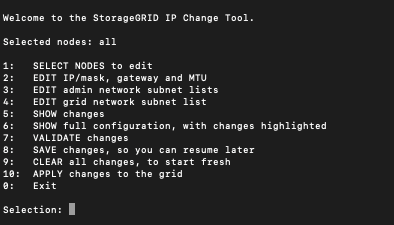

= Modifier la configuration réseau du nœud
:allow-uri-read: 
:icons: font
:imagesdir: ../media/

[role="lead"]
Vous pouvez modifier la configuration réseau d'un ou plusieurs nœuds à l'aide de l'outil Modifier IP. Vous pouvez modifier la configuration du réseau Grid ou ajouter, modifier ou supprimer les réseaux d'administration ou de client.

.Avant de commencer
Vous avez le `Passwords.txt` fichier.

.Description de la tâche
*Linux:* si vous ajoutez un noeud de grille au réseau Admin ou au réseau client pour la première fois, et que vous n'avez pas configuré précédemment ADMIN_NETWORK_TARGET ni CLIENT_NETWORK_TARGET dans le fichier de configuration de noeud, vous devez le faire maintenant.

Consultez les instructions d'installation de StorageGRID pour votre système d'exploitation Linux :

* link:../rhel/index.html["Installez StorageGRID sur Red Hat Enterprise Linux"]
* link:../ubuntu/index.html["Installez StorageGRID sur Ubuntu ou Debian"]

*Appareils :* sur les appareils StorageGRID, si le réseau client ou administrateur n'a pas été configuré dans le programme d'installation de l'appliance StorageGRID pendant l'installation initiale, le réseau ne peut pas être ajouté en utilisant uniquement l'outil Modifier IP. Tout d'abord, vous devez https://docs.netapp.com/us-en/storagegrid-appliances/commonhardware/placing-appliance-into-maintenance-mode.html["mettez l'appareil en mode de maintenance"^] configurer les liaisons, remettre l'appliance en mode de fonctionnement normal, puis utiliser l'outil Modifier IP pour modifier la configuration réseau. Voir la https://docs.netapp.com/us-en/storagegrid-appliances/installconfig/configuring-network-links.html["procédure de configuration des liens réseau"^].

Vous pouvez modifier l'adresse IP, le masque de sous-réseau, la passerelle ou la valeur MTU d'un ou plusieurs nœuds sur n'importe quel réseau.

Vous pouvez également ajouter ou supprimer un nœud d'un réseau client ou d'un réseau d'administration :

* Vous pouvez ajouter un nœud à un réseau client ou à un réseau d'administration en ajoutant une adresse IP/un masque de sous-réseau sur ce réseau au nœud.
* Vous pouvez supprimer un nœud d'un réseau client ou d'un réseau d'administration en supprimant l'adresse IP/le masque de sous-réseau du nœud sur ce réseau.
+
Impossible de supprimer des nœuds du réseau Grid.

NOTE: Les échanges d'adresses IP ne sont pas autorisés. Si vous devez échanger des adresses IP entre des noeuds de grille, vous devez utiliser une adresse IP intermédiaire temporaire.

NOTE: Si l'authentification unique (SSO) est activée pour votre système StorageGRID et que vous modifiez l'adresse IP d'un nœud d'administration, sachez que toute confiance de tiers qui a été configurée à l'aide de l'adresse IP du nœud d'administration (au lieu de son nom de domaine complet, comme recommandé) deviendra non valide. Vous ne pourrez plus vous connecter au nœud. Immédiatement après avoir modifié l'adresse IP, vous devez mettre à jour ou reconfigurer la confiance de l'organisme de confiance du nœud dans Active Directory Federation Services (AD FS) avec la nouvelle adresse IP. Voir les instructions pour link:../admin/configuring-sso.html["Configuration de SSO"].

NOTE: Toutes les modifications que vous apportez au réseau à l'aide de l'outil Modifier IP sont propagées au micrologiciel du programme d'installation des appliances StorageGRID. Ainsi, si le logiciel StorageGRID est réinstallé sur une appliance ou si une appliance est placée en mode de maintenance, la configuration réseau est correcte.

.Étapes
. Connectez-vous au nœud d'administration principal :
+
.. Entrez la commande suivante : `ssh admin@_primary_Admin_Node_IP_`
.. Saisissez le mot de passe indiqué dans le `Passwords.txt` fichier.
.. Entrez la commande suivante pour basculer en root : `su -`
.. Saisissez le mot de passe indiqué dans le `Passwords.txt` fichier.

+
Lorsque vous êtes connecté en tant que root, l'invite passe de `$` à `#`.

. Démarrez l'outil Modifier IP en entrant la commande suivante : `change-ip`
. Saisissez la phrase de passe de provisionnement à l'invite.
+
Le menu principal s'affiche.

+

. Vous pouvez également sélectionner *1* pour choisir les nœuds à mettre à jour. Sélectionnez ensuite l'une des options suivantes :
+
** *1* : nœud unique -- sélectionnez par nom
** *2* : nœud unique -- sélectionnez par site, puis par nom
** *3* : nœud unique -- sélectionnez par adresse IP actuelle
** *4*: Tous les nœuds d'un site
** *5* : tous les nœuds de la grille
+
*Remarque :* si vous souhaitez mettre à jour tous les nœuds, laissez "tous" rester sélectionnés.

+
Une fois votre sélection effectuée, le menu principal s'affiche, le champ *noeuds sélectionnés* étant mis à jour pour refléter votre choix. Toutes les actions suivantes sont uniquement réalisées sur les nœuds affichés.

. Dans le menu principal, sélectionnez l'option *2* pour modifier les informations IP/masque, passerelle et MTU pour les nœuds sélectionnés.
+
.. Sélectionnez le réseau sur lequel vous souhaitez apporter des modifications :
+
--
*** *1* : réseau de grille
*** *2*: Réseau d'administration
*** *3*: Réseau client
*** *4* : tous les réseaux

--
+
--
Une fois votre sélection effectuée, l'invite affiche le nom du nœud, le nom du réseau (grille, administrateur ou client), le type de données (IP/masque, passerelle, ou MTU), et valeur actuelle.

La modification de l'adresse IP, de la longueur du préfixe, de la passerelle ou de la MTU d'une interface configurée par DHCP changera l'interface en mode statique. Lorsque vous sélectionnez pour modifier une interface configurée par DHCP, un avertissement s'affiche pour vous informer que l'interface passe en mode statique.

Les interfaces configurées comme `fixed` ne peuvent pas être modifiées.

--
.. Pour définir une nouvelle valeur, saisissez-la dans le format indiqué pour la valeur actuelle.
.. Pour laisser la valeur actuelle inchangée, appuyez sur *entrée*.
.. Si le type de données est `IP/mask`, vous pouvez supprimer le réseau Admin ou client du nœud en entrant *d* ou *0.0.0.0/0*.
.. Après avoir modifié tous les noeuds que vous souhaitez modifier, entrez *q* pour revenir au menu principal.
+
Vos modifications sont conservées jusqu'à ce qu'elles soient supprimées ou appliquées.

. Vérifiez vos modifications en sélectionnant l'une des options suivantes :
+
** *5* : affiche les modifications dans la sortie isolées pour afficher uniquement l'élément modifié. Les modifications sont mises en évidence en vert (ajouts) ou en rouge (suppressions), comme indiqué dans l'exemple de sortie :
+
image::../media/change_ip_tool_edit_ip_mask_sample_output.png[capture d'écran décrite par le texte environnant]

** *6* : affiche les modifications en sortie qui affichent la configuration complète. Les modifications sont mises en surbrillance en vert (ajouts) ou en rouge (suppressions).
+

NOTE: Certaines interfaces de ligne de commande peuvent afficher des ajouts et des suppressions en utilisant le formatage barré. L'affichage correct dépend de votre client terminal prenant en charge les séquences d'échappement VT100 nécessaires.

. Sélectionnez l'option *7* pour valider toutes les modifications.
+
Cette validation garantit que les règles pour les réseaux Grid, Admin et client, telles que l'absence de sous-réseaux superposés, ne sont pas violées.

+
Dans cet exemple, la validation a renvoyé des erreurs.

+
image::../media/change_ip_tool_validate_sample_error_messages.gif[capture d'écran décrite par le texte environnant]

+
Dans cet exemple, la validation a réussi.

+
image::../media/change_ip_tool_validate_sample_passed_messages.gif[capture d'écran décrite par le texte environnant]

. Une fois la validation terminée, choisissez l'une des options suivantes :
+
** *8*: Enregistrer les modifications non appliquées.
+
Cette option vous permet de quitter l'outil Modifier l'IP et de le redémarrer ultérieurement, sans perdre les modifications non appliquées.

** *10* : appliquer la nouvelle configuration réseau.

. Si vous avez sélectionné l'option *10*, choisissez l'une des options suivantes :
+
** *Appliquer* : appliquez les modifications immédiatement et redémarrez automatiquement chaque nœud si nécessaire.
+
Si la nouvelle configuration réseau ne nécessite aucune modification de réseau physique, vous pouvez sélectionner *appliquer* pour appliquer les modifications immédiatement. Les nœuds seront redémarrés automatiquement, si nécessaire. Les nœuds qui doivent être redémarrés s'affichent.

** *Etape* : appliquez les modifications lors du prochain redémarrage manuel des nœuds.
+
Si vous devez apporter des modifications de configuration de réseau physique ou virtuel pour que la nouvelle configuration de réseau fonctionne, vous devez utiliser l'option *stage*, arrêter les nœuds affectés, effectuer les modifications de réseau physique nécessaires et redémarrer les nœuds affectés. Si vous sélectionnez *appliquer* sans effectuer au préalable ces modifications de mise en réseau, les modifications échoueront généralement.

+

NOTE: Si vous utilisez l'option *stage*, vous devez redémarrer le nœud le plus rapidement possible après le staging pour minimiser les interruptions.

** *Annuler*: Ne faites pas de modifications de réseau pour le moment.
+
Si vous n'étiez pas conscient que les modifications proposées nécessitent de redémarrer les nœuds, vous pouvez reporter les modifications pour minimiser l'impact sur les utilisateurs. Si vous sélectionnez *annuler*, vous revenez au menu principal et les modifications sont préservés pour pouvoir les appliquer ultérieurement.

+
Lorsque vous sélectionnez *appliquer* ou *stage*, un nouveau fichier de configuration réseau est généré, le provisionnement est effectué et les nœuds sont mis à jour avec de nouvelles informations de travail.

+
Pendant l'approvisionnement, la sortie affiche l'état au fur et à mesure de l'application des mises à jour.

+
[listing]
----
Generating new grid networking description file...

Running provisioning...

Updating grid network configuration on Name
----

+
Une fois que vous avez appliqué ou échelé les modifications, un nouveau package de récupération est généré à la suite de la modification de la configuration de la grille.

. Si vous avez sélectionné *stage*, suivez ces étapes une fois le provisionnement terminé :
+
.. Apportez les modifications nécessaires au réseau physique ou virtuel.
+
*Modifications de mise en réseau physique* : apportez les modifications nécessaires à la mise en réseau physique, en arrêtant le nœud en toute sécurité si nécessaire.

+
*Linux* : si vous ajoutez le nœud à un réseau Admin ou client pour la première fois, assurez-vous d'avoir ajouté l'interface comme décrit dans link:linux-adding-interfaces-to-existing-node.html["Linux : ajoutez des interfaces au nœud existant"].

.. Redémarrez les nœuds concernés.

. Sélectionnez *0* pour quitter l'outil Modifier l'IP une fois les modifications effectuées.
. Téléchargez un nouveau package de récupération depuis Grid Manager.
+
.. Sélectionnez *MAINTENANCE* > *système* > *progiciel de récupération*.
.. Saisissez la phrase secrète pour le provisionnement.

