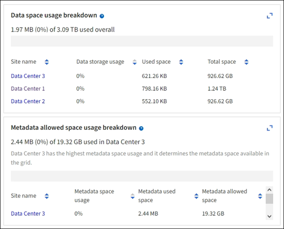
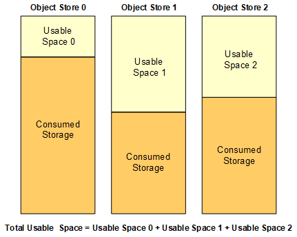

= Surveiller la capacité de stockage
:allow-uri-read: 
:icons: font
:imagesdir: ../media/

[role="lead"]
Contrôlez l'espace total disponible pour vérifier que le système StorageGRID ne manque pas d'espace de stockage pour les objets ou les métadonnées d'objet.

StorageGRID stocke séparément les données d'objet et les métadonnées d'objet. Il réserve un espace spécifique pour une base de données Cassandra distribuée qui contient les métadonnées d'objet. Surveiller la quantité totale d'espace consommée pour les objets et les métadonnées d'objet, ainsi que les tendances en matière de quantité d'espace consommée pour chaque. Vous pourrez ainsi planifier l'ajout de nœuds et éviter toute panne de service.

Vous pouvez link:viewing-storage-tab.html["affichez des informations sur la capacité de stockage"] couvrir l'ensemble de la grille, pour chaque site et pour chaque nœud de stockage du système StorageGRID.

== Surveiller la capacité de stockage pour l'ensemble de la grille

Surveillez la capacité de stockage globale de votre grid afin de vous assurer qu'il reste un espace libre adéquat pour les données d'objet et les métadonnées d'objet. Pour mieux comprendre les variations de capacité de stockage dans le temps, vous pouvez planifier l'ajout de nœuds de stockage ou de volumes avant de consommer la capacité de stockage utilisable de la grille.

Le tableau de bord de Grid Manager vous permet d'évaluer rapidement la quantité de stockage disponible pour l'ensemble du grid et pour chaque data Center. La page nœuds fournit des valeurs plus détaillées pour les données d'objet et les métadonnées d'objet.

.Étapes
. Évaluez la quantité de stockage disponible pour l'ensemble du grid et pour chaque data Center.
+
.. Sélectionnez *Tableau de bord > vue d'ensemble*.
.. Notez les valeurs de la répartition de l'utilisation de l'espace de données et les cartes de répartition de l'utilisation de l'espace autorisé dans les métadonnées. Chaque carte indique un pourcentage d'utilisation du stockage, la capacité de l'espace utilisé et l'espace total disponible ou autorisé par site.
+

NOTE: Le résumé n'inclut pas les supports d'archivage.

+

.. Notez le tableau sur la carte de stockage dans le temps. Utilisez la liste déroulante période pour vous aider à déterminer la rapidité de consommation du stockage.
+
image::../media/dashboard_storage_over_time.png[Graphique stockage dans le temps]

. Pour plus d'informations sur la quantité de stockage utilisée et la quantité de stockage restant disponible dans la grille pour les données d'objet et les métadonnées d'objet, consultez la page nœuds.
+
.. Sélectionnez *NOEUDS*.
.. Sélectionnez *_GRID_* > *stockage*.
+
image::../media/nodes_deployment_storage_tab.png[Onglet stockage de déploiement des nœuds]

.. Placez votre curseur sur les graphiques *stockage utilisé - données d'objet* et *stockage utilisé - métadonnées d'objet* pour connaître la quantité de stockage d'objet et de métadonnées d'objet disponible pour l'ensemble de la grille, ainsi que la quantité utilisée au fil du temps.
+

NOTE: Les valeurs totales d'un site ou de la grille n'incluent pas les nœuds qui n'ont pas signalé de mesures depuis au moins cinq minutes, comme les nœuds hors ligne.

. Planifiez une extension permettant d'ajouter des nœuds de stockage ou des volumes de stockage avant l'utilisation de la capacité de stockage utilisable de la grille.
+
Lors de la planification d'une extension, réfléchissez au temps nécessaire pour approvisionner et installer du stockage supplémentaire.

+

NOTE: Si votre règle ILM utilise le code d'effacement, vous pouvez préférer une extension lorsque les nœuds de stockage existants sont remplis à environ 70 % pour réduire le nombre de nœuds à ajouter.

+
Pour plus d'informations sur la planification d'une extension de stockage, reportez-vous au link:../expand/index.html["Instructions d'extension de StorageGRID"].

== Surveillez la capacité de stockage de chaque nœud de stockage

Surveillez l'espace total utilisable pour chaque nœud de stockage pour vous assurer que le nœud dispose de suffisamment d'espace pour les nouvelles données d'objet.

.Description de la tâche
L'espace utilisable correspond à la quantité d'espace de stockage disponible pour stocker des objets. L'espace total utilisable d'un nœud de stockage est calculé en ajoutant ensemble l'espace disponible sur tous les magasins d'objets du nœud.

.Étapes
. Sélectionnez *NODES* > *_Storage Node_* > *Storage*.
+
Les graphiques et les tableaux du nœud apparaissent.

. Positionnez le curseur sur le graphique de données d'objet stockage utilisé -.
+
Les valeurs suivantes sont affichées :

+
** *Utilisé (%)* : pourcentage de l'espace utilisable total qui a été utilisé pour les données d'objet.
** *Used* : quantité de l'espace utilisable total qui a été utilisé pour les données d'objet.
** *Données répliquées* : estimation de la quantité de données d'objet répliqué sur ce nœud, site ou grille.
** *Données avec code d'effacement* : estimation de la quantité de données d'objet avec code d'effacement sur ce nœud, ce site ou ce grid.
** *Total* : la quantité totale d'espace utilisable sur ce nœud, site ou grille. La valeur utilisée est la `storagegrid_storage_utilization_data_bytes` mesure.
+
image::../media/nodes_page_storage_used_object_data.png[Nœuds stockage de page données d'objet utilisées]

. Passez en revue les valeurs disponibles dans les tableaux volumes et magasins d'objets, sous les graphiques.
+

NOTE: Pour afficher les graphiques de ces valeurs, cliquez sur les icônes du graphique image:../media/icon_chart_new_for_11_5.png["Icône de graphique"]dans les colonnes disponibles.

+
image::../media/nodes_page_storage_tables.png[Les tables de stockage d'objets sont stockées]

. Surveillez les valeurs dans le temps pour estimer le taux de consommation de l'espace de stockage utilisable.
. Pour préserver le fonctionnement normal du système, ajoutez des nœuds de stockage, ajoutez des volumes de stockage ou archivez les données d'objet avant de consommer l'espace utilisable.
+
Lors de la planification d'une extension, réfléchissez au temps nécessaire pour approvisionner et installer du stockage supplémentaire.

+

NOTE: Si votre règle ILM utilise le code d'effacement, vous pouvez préférer une extension lorsque les nœuds de stockage existants sont remplis à environ 70 % pour réduire le nombre de nœuds à ajouter.

+
Pour plus d'informations sur la planification d'une extension de stockage, reportez-vous au link:../expand/index.html["Instructions d'extension de StorageGRID"].

+
L'link:../troubleshoot/troubleshooting-low-object-data-storage-alert.html["Faible stockage des données objet"]alerte est déclenchée lorsque l'espace restant est insuffisant pour stocker les données d'objet sur un nœud de stockage.

== Surveillez la capacité des métadonnées d'objet pour chaque nœud de stockage

Surveillez l'utilisation des métadonnées pour chaque nœud de stockage afin de garantir qu'un espace adéquat reste disponible pour les opérations essentielles de la base de données. Vous devez ajouter de nouveaux nœuds de stockage sur chaque site avant que les métadonnées d'objet dépassent 100 % de l'espace autorisé pour les métadonnées.

.Description de la tâche
StorageGRID conserve trois copies des métadonnées d'objet sur chaque site pour assurer la redondance et protéger les métadonnées d'objet contre la perte. Les trois copies sont réparties de manière homogène sur tous les nœuds de stockage de chaque site, en utilisant l'espace réservé aux métadonnées sur le volume de stockage 0 de chaque nœud de stockage.

Dans certains cas, la capacité des métadonnées d'objet de la grille peut être utilisée plus rapidement que la capacité de stockage objet. Par exemple, si vous ingérer généralement un grand nombre d'objets de petite taille, vous devrez ajouter des nœuds de stockage pour augmenter la capacité des métadonnées, même si la capacité de stockage objet est suffisante.

L'utilisation des métadonnées peut notamment être augmentée, comme la taille et la quantité des métadonnées et du balisage, le nombre total d'éléments d'un téléchargement partitionné et la fréquence des modifications apportées aux emplacements de stockage ILM.

.Étapes
. Sélectionnez *NODES* > *_Storage Node_* > *Storage*.
. Positionnez le curseur sur le graphique de métadonnées de l'objet stockage utilisé - pour afficher les valeurs d'une heure spécifique.
+
image::../media/storage_used_object_metadata.png[Stockage utilisé : métadonnées d'objet]

+
Utilisé (%):: Pourcentage de l'espace de métadonnées autorisé utilisé sur ce nœud de stockage.
+
--
Metrics Prometheus : `storagegrid_storage_utilization_metadata_bytes` et `storagegrid_storage_utilization_metadata_allowed_bytes`

--
Utilisé:: Les octets de l'espace de métadonnées autorisé qui ont été utilisés sur ce nœud de stockage.
+
--
Prometheus métrique : `storagegrid_storage_utilization_metadata_bytes`

--
Autorisé:: Espace autorisé pour les métadonnées d'objet sur ce nœud de stockage. Pour savoir comment cette valeur est déterminée pour chaque nœud de stockage, reportez-vous au link:../admin/managing-object-metadata-storage.html#allowed-metadata-space["Description complète de l'espace de métadonnées autorisé"].
+
--
Prometheus métrique : `storagegrid_storage_utilization_metadata_allowed_bytes`

--
Réservé réelle:: Espace réel réservé aux métadonnées sur ce nœud de stockage. Inclut l'espace autorisé et l'espace requis pour les opérations essentielles sur les métadonnées. Pour savoir comment cette valeur est calculée pour chaque nœud de stockage, reportez-vous au link:../admin/managing-object-metadata-storage.html#actual-reserved-space-for-metadata["Description complète de l'espace réservé réel pour les métadonnées"].
+
--
_Prometheus métrique sera ajouté dans une prochaine version._

--

+

NOTE: Les valeurs totales d'un site ou de la grille n'incluent pas les nœuds qui n'ont pas signalé de mesures depuis au moins cinq minutes, comme les nœuds hors ligne.

. Si la valeur *utilisée (%)* est de 70 % ou plus, développez votre système StorageGRID en ajoutant des nœuds de stockage à chaque site.
+

CAUTION: L'alerte *stockage de métadonnées faible* est déclenchée lorsque la valeur *utilisée (%)* atteint certains seuils. Les résultats indésirables peuvent se produire si les métadonnées de l'objet utilisent plus de 100 % de l'espace autorisé.

+
Lorsque vous ajoutez des nœuds, le système rééquilibre automatiquement les métadonnées d'objet sur tous les nœuds de stockage du site. Voir la link:../expand/index.html["Instructions d'extension d'un système StorageGRID"].

== Surveillez les prévisions d'utilisation de l'espace

Surveillez les prévisions d'utilisation de l'espace pour les données utilisateur et les métadonnées afin d'estimer quand vous en aurez besoin link:../expand/index.html["développez une grille"].

Si vous remarquez que le taux de consommation change au fil du temps, sélectionnez une plage plus courte dans le menu déroulant *moyenne sur* pour refléter uniquement les modèles d'ingestion les plus récents. Si vous remarquez des motifs saisonniers, sélectionnez une plage plus longue.

Si vous disposez d'une nouvelle installation StorageGRID, autorisez l'accumulation de données et de métadonnées avant d'évaluer les prévisions d'utilisation de l'espace.

.Étapes
. Sur le tableau de bord, sélectionnez *stockage*.
. Affichez les cartes du tableau de bord, la prévision de l'utilisation des données par pool de stockage et la prévision de l'utilisation des métadonnées par site.
. Utilisez ces valeurs pour déterminer quand ajouter de nouveaux nœuds de stockage pour le stockage des données et des métadonnées.

image::../media/forecast-metadata-usage.png[Prévision de l'utilisation des métadonnées par site]
