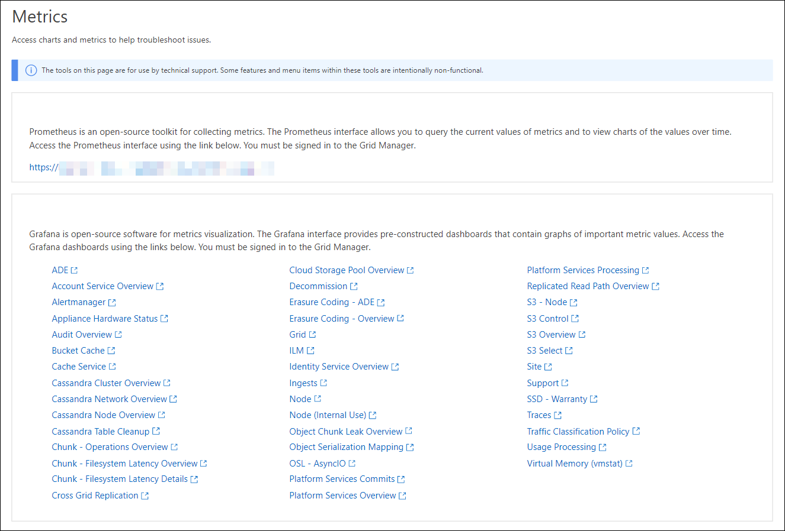

= Examinez les metrics de support
:allow-uri-read: 
:icons: font
:imagesdir: ../media/

[role="lead"]
Lorsque vous dépannez un problème, vous pouvez consulter les graphiques et les metrics détaillés de votre système StorageGRID en collaboration avec le support technique.

.Avant de commencer
* Vous devez être connecté au Gestionnaire de grille à l'aide d'un link:../admin/web-browser-requirements.html["navigateur web pris en charge"].
* Vous avez link:../admin/admin-group-permissions.html["autorisations d'accès spécifiques"].

.Description de la tâche
La page Metrics vous permet d'accéder aux interfaces utilisateur de Prometheus et Grafana. Prometheus est un logiciel open source qui permet de collecter des metrics. Grafana est un logiciel open source permettant de visualiser les metrics.

NOTE: Les outils disponibles sur la page métriques sont destinés au support technique. Certaines fonctions et options de menu de ces outils sont intentionnellement non fonctionnelles et peuvent faire l'objet de modifications. Voir la liste de link:commonly-used-prometheus-metrics.html["Metrics Prometheus couramment utilisés"].

.Étapes
. Comme indiqué par le support technique, sélectionnez *SUPPORT* > *Outils* > *métriques*.
+
Voici un exemple de la page métriques :

+

. Pour interroger les valeurs actuelles des metrics StorageGRID et afficher les graphiques des valeurs dans le temps, cliquez sur le lien de la section Prometheus.
+
L'interface Prometheus s'affiche. Vous pouvez utiliser cette interface pour exécuter des requêtes sur les mesures StorageGRID disponibles et pour générer des graphiques sur les mesures StorageGRID au fil du temps.

+

NOTE: Les indicateurs qui incluent _private_ dans leurs noms sont destinés à un usage interne uniquement et peuvent être modifiés sans préavis entre les versions de StorageGRID.

. Pour accéder aux tableaux de bord pré-construits contenant des graphiques des mesures StorageGRID au fil du temps, cliquez sur les liens de la section Grafana.
+
L'interface Grafana pour le lien que vous avez sélectionné s'affiche.

+
image::../media/metrics_page_grafana.png[Metrics page Grafana]

