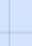

= Utilisez des graphiques et des graphiques
:allow-uri-read: 
:icons: font
:imagesdir: ../media/

[role="lead"]
Vous pouvez utiliser des graphiques et des rapports pour surveiller l'état du système StorageGRID et résoudre les problèmes.

NOTE: Le Gestionnaire de grille est mis à jour avec chaque version et peut ne pas correspondre aux exemples de captures d'écran de cette page.

== Types de graphiques

Les graphiques et les graphiques résument les valeurs des mesures et des attributs StorageGRID spécifiques.

Le tableau de bord Grid Manager inclut des cartes qui résument le stockage disponible pour la grille et chaque site.

image::../media/dashboard_data_and_metadata_space_usage_breakdown.png[Répartition de l'utilisation de l'espace des métadonnées et des données du tableau de bord]

Le panneau Storage usage (utilisation du stockage) du tableau de bord du gestionnaire de locataires affiche les informations suivantes :

* Liste des compartiments les plus grands (S3) ou des conteneurs (Swift) du locataire
* Un graphique à barres qui représente les tailles relatives des grands godets ou conteneurs
* La quantité totale d'espace utilisé et, si un quota est défini, la quantité et le pourcentage d'espace restant

image::../media/tenant_dashboard_with_buckets.png[Tableau de bord des locataires]

De plus, les graphiques qui montrent comment les mesures et les attributs StorageGRID changent au fil du temps sont disponibles à partir de la page nœuds et de la page *SUPPORT* > *Outils* > *topologie de grille*.

Il existe quatre types de graphiques :

* *Graphiques Grafana* : affichés sur la page nœuds, les graphiques Grafana sont utilisés pour tracer les valeurs des metrics Prometheus dans le temps. Par exemple, l'onglet *NOEUDS* > *réseau* d'un noeud de stockage comprend un tableau Grafana pour le trafic réseau.
+
image::../media/nodes_page_network_tab.png[Page noeuds onglet réseau]

+

NOTE: Les graphiques Grafana sont également inclus dans les tableaux de bord pré-construits disponibles à partir de la page *SUPPORT* > *Tools* > *Metrics*.

* *Graphiques linéaires* : disponibles à partir de la page nœuds et de la page *SUPPORT* > *Outils* > *topologie de grille* (sélectionnez l'icône de graphique image:../media/icon_chart_new_for_11_5.png["Graphique d'icônes (Nouveau)"]après une valeur de données), les graphiques linéaires sont utilisés pour tracer les valeurs des attributs StorageGRID ayant une valeur unitaire (comme le décalage de fréquence NTP, en ppm). Les modifications de la valeur sont tracées dans des intervalles de données réguliers (bacs) au fil du temps.
+
image::../media/line_graph.gif[Graphique linéaire]

* *Graphiques de surface* : disponibles à partir de la page nœuds et de la page *SUPPORT* > *Outils* > *topologie de grille* (sélectionnez l'icône de graphique image:../media/icon_chart_new_for_11_5.png["Graphique d'icônes (Nouveau)"]après une valeur de données), les graphiques de zone sont utilisés pour tracer les quantités d'attributs volumétriques, telles que les nombres d'objets ou les valeurs de charge de service. Les graphiques de zone sont similaires aux graphiques de ligne, mais incluent un ombrage marron clair en dessous de la ligne. Les modifications de la valeur sont tracées dans des intervalles de données réguliers (bacs) au fil du temps.
+
image::../media/area_graph.gif[Graphique de zone]

* Certains graphiques sont signalés par un autre type d'icône de graphique image:../media/icon_chart_new_for_11_5.png["Icône de graphique"]et ont un format différent :
+
image::../media/charts_lost_object_detected.png[Objets perdus graphiques détectés]

* *Graphique d'état* : disponible à partir de la page *SUPPORT* > *Outils* > *topologie de grille* (sélectionnez l'icône du graphique image:../media/icon_chart_new_for_11_5.png["Graphique d'icônes (Nouveau)"]après une valeur de données), les graphiques d'état sont utilisés pour tracer des valeurs d'attribut représentant des États distincts, tels qu'un état de service pouvant être en ligne, en veille ou hors ligne. Les graphiques d'état sont similaires aux graphiques linéaires, mais la transition est discontinue. En d'autres termes, la valeur passe d'une valeur d'état à une autre.
+
image::../media/state_graph.gif[Graphique d'état]

.Informations associées
* link:viewing-nodes-page.html["Afficher la page nœuds"]
* link:viewing-grid-topology-tree.html["Afficher l'arborescence de la grille topologique"]
* link:reviewing-support-metrics.html["Examinez les metrics de support"]

== Légende du graphique

Les lignes et les couleurs utilisées pour dessiner des graphiques ont une signification spécifique.

[cols="1a,3a"]
|===
| Exemple | Signification 

 a| 
image:../media/dark_green_chart_line.gif["capture d'écran affichant une ligne verte foncée"]
 a| 
Les valeurs des attributs signalés sont tracées à l'aide de lignes vert foncé.

 a| 
image:../media/light_green_chart_line.gif["capture d'écran montrant l'ombrage qui indique l'égrenage des données"]
 a| 
Un ombrage vert clair autour des lignes vert foncé indique que les valeurs réelles de cette plage horaire varient et ont été « regroupées » pour un tracé plus rapide. La ligne foncée représente la moyenne pondérée. La plage en vert clair indique les valeurs maximum et minimum dans le bac. L'ombrage marron clair est utilisé pour les graphiques de zone pour indiquer les données volumétriques.

 a| 
image:../media/no_data_plotted_chart.gif["capture d'écran affichant des zones vierges sur la ligne de tracé"]
 a| 
Les zones vierges (aucune donnée tracée) indiquent que les valeurs d'attribut ne sont pas disponibles. L'arrière-plan peut être bleu, gris ou un mélange de gris et de bleu, selon l'état du service signalant l'attribut.

 a| 

 a| 
L'ombrage bleu clair indique que certaines ou toutes les valeurs d'attribut à ce moment étaient indéterminées ; l'attribut n'a pas signalé de valeurs parce que le service était dans un état inconnu.

 a| 
image:../media/gray_chart_shading.gif["capture d'écran montrant l'ombrage gris en raison de valeurs inconnues"]
 a| 
L'ombrage gris indique que certaines ou toutes les valeurs d'attribut à ce moment n'étaient pas connues car le service signalant les attributs était administrativement en panne.

 a| 
image:../media/gray_blue_chart_shading.gif["capture d'écran montrant un mélange de valeurs indéterminées et inconnues"]
 a| 
Un mélange d'ombrage gris et bleu indique que certaines des valeurs d'attribut au moment étaient indéterminées (parce que le service était dans un état inconnu), tandis que d'autres n'étaient pas connus car le service signalant les attributs était administrativement en panne.

|===

== Affichez des graphiques et des graphiques

La page nœuds contient les graphiques et les graphiques auxquels vous devez accéder régulièrement pour surveiller les attributs tels que la capacité de stockage et le débit. Dans certains cas, en particulier lorsque vous travaillez avec le support technique, vous pouvez utiliser la page *SUPPORT* > *Outils* > *topologie de grille* pour accéder à des graphiques supplémentaires.

.Avant de commencer
Vous devez être connecté au Gestionnaire de grille à l'aide d'un link:../admin/web-browser-requirements.html["navigateur web pris en charge"].

.Étapes
. Sélectionnez *NOEUDS*. Ensuite, sélectionnez un nœud, un site ou la grille entière.
. Sélectionnez l'onglet pour lequel vous souhaitez afficher les informations.
+
Certains onglets comprennent un ou plusieurs graphiques Grafana, qui sont utilisés pour tracer les valeurs des metrics Prometheus dans le temps. Par exemple, l'onglet *NODES* > *Hardware* d'un noeud comprend deux diagrammes Grafana.

+
image::../media/nodes_page_hardware_tab_graphs.png[Graphiques de l'onglet matériel de la page nœuds]

. Si vous le souhaitez, placez votre curseur sur le graphique pour afficher des valeurs plus détaillées pour un point particulier dans le temps.
+
image::../media/nodes_page_memory_usage_details.png[Nœuds page Détails de l'utilisation de la mémoire]

. Si nécessaire, vous pouvez souvent afficher un graphique pour un attribut ou une mesure spécifique. Dans le tableau de la page nœuds, sélectionnez l'icône de graphique image:../media/icon_chart_new_for_11_5.png["Icône de graphique"]située à droite du nom de l'attribut.
+

NOTE: Les graphiques ne sont pas disponibles pour toutes les mesures et tous les attributs.

+
*Exemple 1* : dans l'onglet objets d'un noeud de stockage, vous pouvez sélectionner l'icône du diagramme image:../media/icon_chart_new_for_11_5.png["Icône de graphique"]pour voir le nombre total de requêtes de stockage de métadonnées réussies pour le noeud de stockage.

+
image::../media/nodes_page_objects_successful_metadata_queries.png[Requêtes de métadonnées réussies]

+
image::../media/nodes_page-objects_chart_successful_metadata_queries.png[Diagrammes requêtes de métadonnées réussies]

+
*Exemple 2* : dans l'onglet objets d'un noeud de stockage, vous pouvez sélectionner l'icône du graphique image:../media/icon_chart_new_for_11_5.png["Icône de graphique"]pour afficher le graphique Grafana du nombre d'objets perdus détectés au fil du temps.

+
image::../media/object_count_table.png[Tableau nombre d'objets]

+
image::../media/charts_lost_object_detected.png[Objets perdus graphiques détectés]

. Pour afficher les graphiques des attributs qui ne sont pas affichés sur la page nœud, sélectionnez *SUPPORT* > *Outils* > *topologie de grille*.
. Sélectionnez *_grid node_* > *_component ou service_* > *Présentation* > *main*.
+
image::../media/nms_chart.gif[capture d'écran décrite par le texte environnant]

. Sélectionnez l'icône de graphique image:../media/icon_chart_new_for_11_5.png["Icône de graphique"]en regard de l'attribut.
+
L'affichage passe automatiquement à la page *Rapports* > *graphiques*. Le graphique affiche les données de l'attribut au cours du dernier jour.

== Générer des graphiques

Les graphiques affichent une représentation graphique des valeurs de données d'attribut. Vous pouvez générer des rapports sur un site de data Center, un nœud grid, un composant ou un service.

.Avant de commencer
* Vous devez être connecté au Gestionnaire de grille à l'aide d'un link:../admin/web-browser-requirements.html["navigateur web pris en charge"].
* Vous avez link:../admin/admin-group-permissions.html["autorisations d'accès spécifiques"].

.Étapes
. Sélectionnez *SUPPORT* > *Outils* > *topologie de grille*.
. Sélectionnez *_grid node_* > *_component ou service_* > *Rapports* > *diagrammes*.
. Sélectionnez l'attribut à rapporter dans la liste déroulante *attribut*.
. Pour forcer l'axe y à commencer à zéro, décochez la case *mise à l'échelle verticale*.
. Pour afficher les valeurs avec une précision maximale, cochez la case *données brutes* ou pour arrondir les valeurs à un maximum de trois décimales (par exemple, pour les attributs signalés en pourcentage), décochez la case *données brutes*.
. Sélectionnez la période à laquelle effectuer le rapport dans la liste déroulante *requête rapide*.
+
Sélectionnez l'option requête personnalisée pour sélectionner une plage de temps spécifique.

+
Le graphique apparaît après quelques instants. Prévoir plusieurs minutes pour la totalisation de longues plages de temps.

. Si vous avez sélectionné requête personnalisée, personnalisez la période de temps du graphique en saisissant *Date de début* et *Date de fin*.
+
Utilisez le format `_YYYY/MM/DDHH:MM:SS_` en heure locale. Des zéros non significatifs sont nécessaires pour correspondre au format. Par exemple, la validation a échoué dans 2017/4/6 7:30:00. Le format correct est: 2017/04/06 07:30:00.

. Sélectionnez *mettre à jour*.
+
Un graphique est généré après quelques secondes. Prévoir plusieurs minutes pour la totalisation de longues plages de temps. En fonction de la durée définie pour la requête, un rapport texte brut ou texte agrégé s'affiche.

