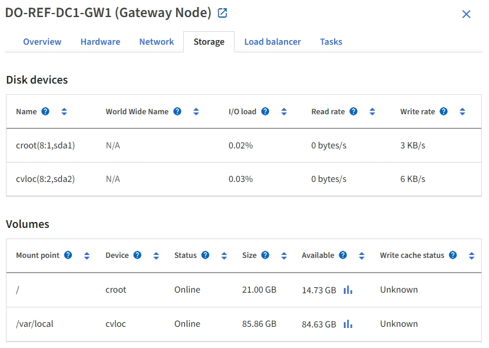

= Afficher l'onglet matériel
:allow-uri-read: 
:icons: font
:imagesdir: ../media/

[role="lead"]
L'onglet matériel affiche l'utilisation du CPU et de la mémoire pour chaque nœud, ainsi que des informations supplémentaires sur le matériel des appliances.

NOTE: Le Gestionnaire de grille est mis à jour avec chaque version et peut ne pas correspondre aux exemples de captures d'écran de cette page.

L'onglet matériel s'affiche pour tous les nœuds.

image::../media/nodes_page_hardware_tab_graphs.png[Onglet matériel de la page nœuds]

Pour afficher un intervalle de temps différent, sélectionnez l'une des commandes au-dessus du graphique ou du graphique. Vous pouvez afficher les informations disponibles pour les intervalles de 1 heure, 1 jour, 1 semaine ou 1 mois. Vous pouvez également définir un intervalle personnalisé, qui vous permet de spécifier des plages de date et d'heure.

Pour afficher des détails sur l'utilisation du CPU et de la mémoire, placez votre curseur sur chaque graphique.

image::../media/nodes_page_memory_usage_details.png[Page noeuds > matériel > Détails de l'utilisation de la mémoire]

Si le nœud est un nœud d'appliance, cet onglet inclut également une section contenant des informations supplémentaires sur le matériel de l'appliance.

== Afficher des informations sur les nœuds de stockage de l'appliance

La page nœuds répertorie les informations relatives à l'état des services et à toutes les ressources de calcul, de périphérique de disque et de réseau pour chaque nœud de stockage d'appliance. Vous pouvez également afficher la mémoire, le matériel de stockage, la version du firmware des contrôleurs, les ressources réseau, les interfaces réseau, les adresses réseau et de réception et de transmission des données.

.Étapes
. Sur la page nœuds, sélectionnez un nœud de stockage d'appliance.
. Sélectionnez *vue d'ensemble*.
+
La section informations sur le nœud de l'onglet Présentation affiche un récapitulatif des informations sur le nœud, telles que le nom, le type, l'ID et l'état de connexion du nœud. La liste des adresses IP inclut le nom de l'interface pour chaque adresse, comme suit :

+
** *Eth* : réseau Grid, réseau Admin ou réseau client.
** *Hic* : un des ports physiques 10, 25 ou 100 GbE de l'appareil. Ces ports peuvent être liés ensemble et connectés au réseau StorageGRID Grid Network (eth0) et au réseau client (eth2).
** *mtc* : l'un des ports physiques 1 GbE de l'appareil. Une ou plusieurs interfaces mtc sont liées pour former l'interface réseau d'administration StorageGRID (eth1). Vous pouvez laisser d'autres interfaces mtc disponibles pour une connectivité locale temporaire pour un technicien du centre de données.
+
image::../media/nodes_page_overview_tab_extended.png[Vue d'ensemble de la page nœuds étendue]

+
La section alertes de l'onglet Overview affiche toutes les alertes actives du nœud.

. Sélectionnez *matériel* pour plus d'informations sur l'appareil.
+
.. Affichez les graphiques d'utilisation de l'UC et de la mémoire pour déterminer les pourcentages d'utilisation de l'UC et de la mémoire au fil du temps. Pour afficher un intervalle de temps différent, sélectionnez l'une des commandes au-dessus du graphique ou du graphique. Vous pouvez afficher les informations disponibles pour les intervalles de 1 heure, 1 jour, 1 semaine ou 1 mois. Vous pouvez également définir un intervalle personnalisé, qui vous permet de spécifier des plages de date et d'heure.
+
image::../media/nodes_page_hardware_tab_graphs.png[Graphiques de matériel]

.. Faites défiler vers le bas pour afficher le tableau des composants de l'appareil. Ce tableau contient des informations telles que le nom du modèle de l'appliance, les noms des contrôleurs, les numéros de série et les adresses IP, ainsi que l'état de chaque composant.
+

NOTE: Certains champs, tels que le contrôleur de calcul BMC IP et le matériel de calcul, apparaissent uniquement pour les appliances dotées de cette fonctionnalité.

+
Les composants des tiroirs de stockage et des tiroirs d'extension s'ils font partie de l'installation apparaissent dans un tableau séparé sous le tableau de l'appliance.

+
image::../media/nodes_page_hardware_tab_for_appliance.png[Page noeuds onglet matériel de l'appliance]

+
[cols="1a,2a"]
|===
| Dans la table Appliance | Description 

 a| 
Modèle de type appliance
 a| 
Le numéro de modèle de cette appliance StorageGRID est indiqué dans SANtricity OS.

 a| 
Nom du contrôleur de stockage
 a| 
Nom de cette appliance StorageGRID représenté dans SANtricity OS.

 a| 
IP de gestion A du contrôleur de stockage
 a| 
Adresse IP du port de gestion 1 du contrôleur de stockage A. cette adresse IP vous permet d'accéder à SANtricity OS pour résoudre les problèmes de stockage.

 a| 
IP de gestion du contrôleur de stockage B
 a| 
Adresse IP du port de gestion 1 du contrôleur de stockage B. cette adresse IP vous permet d'accéder à SANtricity OS pour résoudre les problèmes de stockage.

Certains modèles d'appliance ne disposent pas de contrôleur de stockage B.

 a| 
WWID du contrôleur de stockage
 a| 
Identifiant universel du contrôleur de stockage indiqué dans SANtricity OS.

 a| 
Numéro de série du châssis de l'appliance de stockage
 a| 
Numéro de série du châssis de l'appareil.

 a| 
Version du firmware du contrôleur de stockage
 a| 
Version du firmware du contrôleur de stockage de cette appliance.

 a| 
Version du contrôleur de stockage SANtricity OS
 a| 
Version SANtricity OS du contrôleur de stockage A.

 a| 
Version NVSRAM du contrôleur de stockage
 a| 
Version NVSRAM du contrôleur de stockage telle que signalée par le Gestionnaire système SANtricity.

Pour les SG6060 et SG6160, si la version de NVSRAM ne correspond pas entre les deux contrôleurs, la version du contrôleur A s'affiche. Si le contrôleur A n'est pas installé ou opérationnel, la version du contrôleur B s'affiche.

 a| 
Matériel de stockage
 a| 
État global du matériel du contrôleur de stockage. Si SANtricity System Manager signale un état de nécessite une intervention pour le matériel de stockage, le système StorageGRID signale également cette valeur.

Si l'état est « nécessite une intervention », vérifiez d'abord le contrôleur de stockage à l'aide de SANtricity OS. Ensuite, assurez-vous qu'il n'existe aucune autre alerte qui s'applique au contrôleur de calcul.

 a| 
Nombre de disques défaillants du contrôleur de stockage
 a| 
Le nombre de disques qui ne sont pas optimaux.

 a| 
Contrôleur de stockage A
 a| 
L'état du contrôleur de stockage A.

 a| 
Contrôleur de stockage B
 a| 
État du contrôleur de stockage B. certains modèles d'appliance ne disposent pas d'un contrôleur de stockage B.

 a| 
Alimentation A du contrôleur de stockage
 a| 
L'état de l'alimentation A du contrôleur de stockage.

 a| 
Alimentation B du contrôleur de stockage
 a| 
L'état de l'alimentation B du contrôleur de stockage.

 a| 
Type de disque de données de stockage
 a| 
Type de disque dur (HDD) ou SSD (Solid State Drive) de l'appliance.

 a| 
Taille du disque de stockage des données
 a| 
La taille effective d'un lecteur de données.

Pour le SG6160, la taille du disque cache s'affiche également.

*Remarque* : pour les nœuds avec tiroirs d'extension, utilisez plutôt le<<shelf_data_drive_size,Taille de disque des données pour chaque tiroir>>. La taille effective du disque peut varier en fonction du tiroir.

 a| 
Mode de stockage RAID
 a| 
Mode RAID configuré pour l'appliance.

 a| 
Connectivité du stockage
 a| 
État de la connectivité du stockage.

 a| 
Bloc d'alimentation général
 a| 
L'état de toutes les alimentations de l'appareil.

 a| 
IP BMC du contrôleur de calcul
 a| 
Adresse IP du port du contrôleur de gestion de la carte mère (BMC) dans le contrôleur de calcul. Vous utilisez cette adresse IP pour vous connecter à l'interface BMC afin de surveiller et de diagnostiquer le matériel de l'appliance.

Ce champ ne s'affiche pas pour les modèles d'appliance qui ne contiennent pas de contrôleur BMC.

 a| 
Numéro de série du contrôleur de calcul
 a| 
Numéro de série du contrôleur de calcul.

 a| 
Matériel de calcul
 a| 
L'état du matériel du contrôleur de calcul. Ce champ ne s'affiche pas pour les modèles d'appliance qui ne disposent pas de matériel de calcul et de stockage distinct.

 a| 
Température du processeur du contrôleur de calcul
 a| 
L'état de température de l'UC du contrôleur de calcul.

 a| 
Température du châssis du contrôleur de calcul
 a| 
État de température du contrôleur de calcul.

|===
+
[cols="1a,2a"]
|===
| Dans le tableau tiroirs de stockage | Description 

 a| 
Numéro de série du châssis du tiroir
 a| 
Numéro de série du châssis du tiroir de stockage.

 a| 
ID du tiroir
 a| 
Identificateur numérique du tiroir de stockage.

*** 99 : tiroir contrôleur de stockage
*** 0 : premier tiroir d'extension
*** 1 : second tiroir d'extension

*Remarque :* les étagères d'extension s'appliquent uniquement aux SG6060 et SG6160.

 a| 
État du tiroir
 a| 
État global du shelf de stockage.

 a| 
État du module d'E/S.
 a| 
L'état des modules d'entrée/sortie (IOM) de tous les tiroirs d'extension. S/O s'il ne s'agit pas d'un tiroir d'extension.

 a| 
État de l'alimentation électrique
 a| 
État global des alimentations du tiroir de stockage.

 a| 
État du tiroir
 a| 
L'état des tiroirs dans le tiroir de rangement. N/A si la tablette ne contient pas de tiroirs.

 a| 
État du ventilateur
 a| 
État général des ventilateurs dans le shelf de stockage.

 a| 
Emplacements de lecteur
 a| 
Nombre total de slots de disque dans le shelf de stockage.

 a| 
Disques de données
 a| 
Nombre de disques du tiroir de stockage utilisés pour le stockage de données.

 a| 
[[shelf_Data_drive_size]]taille du lecteur de données
 a| 
Taille effective d'un disque de données dans le tiroir de stockage.

 a| 
Disques en cache
 a| 
Nombre de disques du tiroir de stockage utilisés comme cache.

 a| 
Taille du lecteur de cache
 a| 
La taille du plus petit lecteur de cache dans le tiroir de stockage. En principe, les disques en cache sont de la même taille.

 a| 
État de la configuration
 a| 
L'état de configuration du tiroir de stockage.

|===
.. Confirmer que tous les États sont « nominal ».
+
Si un état n'est pas « nominal », passez en revue les alertes actuelles. Vous pouvez également utiliser SANtricity System Manager pour en savoir plus sur certaines de ces valeurs matérielles. Reportez-vous aux instructions d'installation et d'entretien de votre appareil.

. Sélectionnez *réseau* pour afficher les informations de chaque réseau.
+
Le graphique trafic réseau fournit un récapitulatif du trafic réseau global.

+
image::../media/nodes_page_network_traffic_graph.png[Courbes de trafic réseau de la page noeuds]

+
.. Consultez la section interfaces réseau.
+
image::../media/nodes_page_network_interfaces.png[Nœuds page interfaces réseau]

+
Utilisez le tableau suivant avec les valeurs de la colonne *Speed* du tableau interfaces réseau pour déterminer si les ports réseau 10/25-GbE de l'appliance ont été configurés pour utiliser le mode actif/sauvegarde ou le mode LACP.

+

NOTE: Les valeurs indiquées dans le tableau supposent que les quatre liens sont utilisés.

+
[cols="1a,1a,1a,1a"]
|===
| Mode de liaison | Mode du lien | Vitesse de la liaison HIC individuelle (hic 1, hi2, hic 3, hic 4) | Vitesse réseau prévue pour la grille/le client (eth0, eth2) 

 a| 
Agrégat
 a| 
LACP
 a| 
25
 a| 
100

 a| 
Fixe
 a| 
LACP
 a| 
25
 a| 
50

 a| 
Fixe
 a| 
Actif/sauvegarde
 a| 
25
 a| 
25

 a| 
Agrégat
 a| 
LACP
 a| 
10
 a| 
40

 a| 
Fixe
 a| 
LACP
 a| 
10
 a| 
20

 a| 
Fixe
 a| 
Actif/sauvegarde
 a| 
10
 a| 
10

|===
+
Pour plus d'informations sur la configuration des ports 10/25-GbE, reportez-vous à la section https://docs.netapp.com/us-en/storagegrid-appliances/installconfig/configuring-network-links.html["Configurer les liaisons réseau"^].

.. Passez en revue la section communication réseau.
+
Les tableaux de réception et de transmission indiquent le nombre d'octets et de paquets reçus et envoyés sur chaque réseau ainsi que d'autres mesures de réception et de transmission.

+
image::../media/nodes_page_network_communication.png[Nœuds page réseau Comm]

. Sélectionnez *Storage* pour afficher les graphiques qui affichent les pourcentages de stockage utilisés dans le temps pour les données d'objet et les métadonnées d'objet, ainsi que des informations sur les unités de disque, les volumes et les magasins d'objets.
+
image::../media/nodes_page_storage_used_object_data.png[Stockage utilisé : données d'objet]

+
image::../media/storage_used_object_metadata.png[Stockage utilisé : métadonnées d'objet]

+
.. Faites défiler vers le bas pour afficher les quantités de stockage disponibles pour chaque volume et magasin d'objets.
+
Le nom mondial de chaque disque correspond à l'identifiant universel (WWID) du volume qui s'affiche lorsque vous affichez les propriétés standard du volume dans SANtricity OS (le logiciel de gestion connecté au contrôleur de stockage de l'appliance).

+
Pour vous aider à interpréter les statistiques de lecture et d'écriture du disque relatives aux points de montage du volume, la première partie du nom affichée dans la colonne *Name* de la table Disk Devices (c'est-à-dire _sdc_, _sdd_, _sde_, etc.) correspond à la valeur indiquée dans la colonne *Device* de la table volumes.

+
image::../media/nodes_page_storage_tables.png[Nœuds tables de stockage des pages]

== Affiche des informations sur les nœuds d'administration de l'appliance et les nœuds de passerelle

La page nœuds répertorie les informations relatives à l'état des services et à toutes les ressources de calcul, de périphérique de disque et de réseau pour chaque appliance de services utilisée comme nœud d'administration ou comme nœud de passerelle. Vous pouvez également afficher la mémoire, le matériel de stockage, les ressources réseau, les interfaces réseau, les adresses réseau, et recevoir et transmettre des données.

.Étapes
. Sur la page nœuds, sélectionnez un nœud d'administration d'appliance ou un nœud de passerelle d'appliance.
. Sélectionnez *vue d'ensemble*.
+
La section informations sur le nœud de l'onglet Présentation affiche un récapitulatif des informations sur le nœud, telles que le nom, le type, l'ID et l'état de connexion du nœud. La liste des adresses IP inclut le nom de l'interface pour chaque adresse, comme suit :

+
** *Adllb* et *adlli* : affiché si la liaison actif/sauvegarde est utilisée pour l'interface réseau d'administration
** *Eth* : réseau Grid, réseau Admin ou réseau client.
** *Hic* : un des ports physiques 10, 25 ou 100 GbE de l'appareil. Ces ports peuvent être liés ensemble et connectés au réseau StorageGRID Grid Network (eth0) et au réseau client (eth2).
** *mtc* : l'un des ports physiques 1 GbE de l'appareil. Une ou plusieurs interfaces mtc sont liées pour former l'interface réseau Admin (eth1). Vous pouvez laisser d'autres interfaces mtc disponibles pour une connectivité locale temporaire pour un technicien du centre de données.
+
image::../media/nodes_page_overview_tab_services_appliance.png[Onglet de présentation de la page nœuds pour l'appliance de services]

+
La section alertes de l'onglet Overview affiche toutes les alertes actives du nœud.

. Sélectionnez *matériel* pour plus d'informations sur l'appareil.
+
.. Affichez les graphiques d'utilisation de l'UC et de la mémoire pour déterminer les pourcentages d'utilisation de l'UC et de la mémoire au fil du temps. Pour afficher un intervalle de temps différent, sélectionnez l'une des commandes au-dessus du graphique ou du graphique. Vous pouvez afficher les informations disponibles pour les intervalles de 1 heure, 1 jour, 1 semaine ou 1 mois. Vous pouvez également définir un intervalle personnalisé, qui vous permet de spécifier des plages de date et d'heure.
+
image::../media/nodes_page_hardware_tab_graphs_services_appliance.png[Page noeuds onglet matériel graphiques de l'appareil de services]

.. Faites défiler vers le bas pour afficher le tableau des composants de l'appareil. Ce tableau contient des informations telles que le nom du modèle, le numéro de série, la version du micrologiciel du contrôleur et l'état de chaque composant.
+
image::../media/nodes_page_hardware_tab_services_appliance.png[Page noeuds onglet matériel de l'appliance de services]

+
[cols="1a,2a"]
|===
| Dans la table Appliance | Description 

 a| 
Modèle de type appliance
 a| 
Numéro de modèle de cette appliance StorageGRID.

 a| 
Nombre de disques défaillants du contrôleur de stockage
 a| 
Le nombre de disques qui ne sont pas optimaux.

 a| 
Type de disque de données de stockage
 a| 
Type de disque dur (HDD) ou SSD (Solid State Drive) de l'appliance.

 a| 
Taille du disque de stockage des données
 a| 
La taille effective d'un lecteur de données.

 a| 
Mode de stockage RAID
 a| 
Mode RAID de l'appareil.

 a| 
Bloc d'alimentation général
 a| 
L'état de toutes les alimentations de l'appareil.

 a| 
IP BMC du contrôleur de calcul
 a| 
Adresse IP du port du contrôleur de gestion de la carte mère (BMC) dans le contrôleur de calcul. Vous pouvez utiliser cette adresse IP pour vous connecter à l'interface BMC afin de surveiller et de diagnostiquer le matériel de l'appliance.

Ce champ ne s'affiche pas pour les modèles d'appliance qui ne contiennent pas de contrôleur BMC.

 a| 
Numéro de série du contrôleur de calcul
 a| 
Numéro de série du contrôleur de calcul.

 a| 
Matériel de calcul
 a| 
L'état du matériel du contrôleur de calcul.

 a| 
Température du processeur du contrôleur de calcul
 a| 
L'état de température de l'UC du contrôleur de calcul.

 a| 
Température du châssis du contrôleur de calcul
 a| 
État de température du contrôleur de calcul.

|===
.. Confirmer que tous les États sont « nominal ».
+
Si un état n'est pas « nominal », passez en revue les alertes actuelles.

. Sélectionnez *réseau* pour afficher les informations de chaque réseau.
+
Le graphique trafic réseau fournit un récapitulatif du trafic réseau global.

+
image::../media/nodes_page_network_traffic_graph.png[Courbes de trafic réseau de la page noeuds]

+
.. Consultez la section interfaces réseau.
+
image::../media/nodes_page_hardware_tab_network_services_appliance.png[Page noeuds onglet matériel serveur de services réseau]

+
Utilisez le tableau suivant avec les valeurs de la colonne *Speed* du tableau interfaces réseau pour déterminer si les quatre ports réseau 40/100-GbE de l'appliance ont été configurés pour utiliser le mode actif/sauvegarde ou le mode LACP.

+

NOTE: Les valeurs indiquées dans le tableau supposent que les quatre liens sont utilisés.

+
[cols="1a,1a,1a,1a"]
|===
| Mode de liaison | Mode du lien | Vitesse de la liaison HIC individuelle (hic 1, hi2, hic 3, hic 4) | Vitesse réseau prévue pour la grille/le client (eth0, eth2) 

 a| 
Agrégat
 a| 
LACP
 a| 
100
 a| 
400

 a| 
Fixe
 a| 
LACP
 a| 
100
 a| 
200

 a| 
Fixe
 a| 
Actif/sauvegarde
 a| 
100
 a| 
100

 a| 
Agrégat
 a| 
LACP
 a| 
40
 a| 
160

 a| 
Fixe
 a| 
LACP
 a| 
40
 a| 
80

 a| 
Fixe
 a| 
Actif/sauvegarde
 a| 
40
 a| 
40

|===
.. Passez en revue la section communication réseau.
+
Les tableaux de réception et de transmission indiquent le nombre d'octets et de paquets reçus et envoyés sur chaque réseau ainsi que d'autres mesures de réception et de transmission.

+
image::../media/nodes_page_network_communication.png[Nœuds page réseau Comm]

. Sélectionnez *Storage* pour afficher des informations sur les unités de disque et les volumes de l'appliance de services.
+

