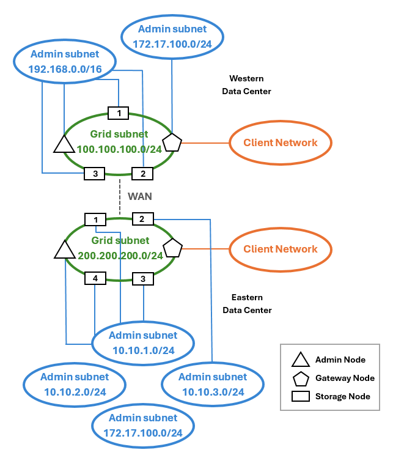

= Topologie des trois réseaux
:allow-uri-read: 
:icons: font
:imagesdir: ../media/

[role="lead"]
Vous pouvez configurer les trois réseaux en une topologie de réseau composée d'un réseau Grid privé, de réseaux d'administration spécifiques à un site délimité et de réseaux clients ouverts. L'utilisation de terminaux d'équilibrage de charge et de réseaux clients non fiables peut fournir une sécurité supplémentaire si nécessaire.

Dans cet exemple :

* Le réseau Grid est utilisé pour le trafic réseau lié aux opérations de gestion d'objets internes.
* Le réseau Admin est utilisé pour le trafic lié aux fonctions administratives.
* Le réseau client est utilisé pour le trafic lié aux requêtes des clients S3.

*Exemple de topologie : réseaux Grid, Admin et client*

