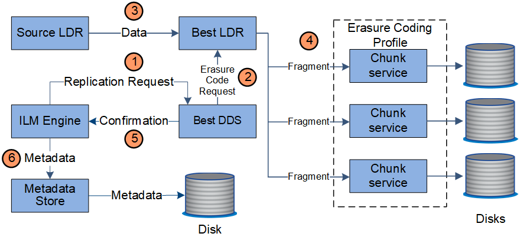

= Gestion des copies
:allow-uri-read: 
:icons: font
:imagesdir: ../media/

[role="lead"]
Les données d'objet sont gérées par les politiques ILM actives et les règles ILM associées. Les règles ILM permettent de réaliser des copies répliquées ou avec code d'effacement pour protéger les données en mode objet contre la perte.

Différents types ou emplacements de copies d'objets peuvent être requis à différents moments de la vie de l'objet. Les règles ILM sont régulièrement évaluées afin de s'assurer que les objets sont placés en fonction des besoins.

Les données d'objet sont gérées par le service LDR.

== Protection du contenu : réplication

Si les instructions de placement de contenu d'une règle ILM nécessitent des copies répliquées des données d'objet, des copies sont créées et stockées sur le disque par les nœuds de stockage qui constituent le pool de stockage configuré.

Le moteur ILM du service LDR contrôle la réplication et garantit le stockage du nombre adéquat de copies aux emplacements corrects et pour le laps de temps correct.

image::../media/replication_data_flow.png[schéma illustrant le processus décrit dans le texte environnant]

. Le moteur ILM interroge le service ADC afin de déterminer le meilleur service LDR de destination au sein du pool de stockage spécifié par la règle ILM. Il envoie ensuite une commande au service LDR pour lancer la réplication.
. Le service LDR de destination interroge le service ADC pour obtenir le meilleur emplacement de la source. Il envoie ensuite une requête de réplication au service LDR source.
. Le service LDR source envoie une copie au service LDR destination.
. Le service LDR de destination informe le moteur ILM que les données objet ont été stockées.
. Le moteur ILM met à jour le magasin de métadonnées avec les métadonnées d'emplacement d'objet.

== Protection du contenu : code d'effacement

Si une règle ILM contient des instructions pour effectuer des copies avec code d'effacement des données d'objet, le schéma de code d'effacement applicable casse les données d'objet en fragments de données et de parité, puis distribue ces fragments entre les nœuds de stockage configurés dans le profil de code d'effacement.

Le moteur ILM, qui est un composant du service LDR, contrôle le code d'effacement et veille à ce que le profil de code d'effacement soit appliqué aux données d'objet.

. Le moteur ILM interroge le service ADC afin de déterminer quel service DDS peut le mieux effectuer l'opération de codage d'effacement. Lorsqu'il est déterminé, le moteur ILM envoie une demande d'initialisation à ce service.
. Le service DDS demande à un LDR de coder les données de l'objet.
. Le service source LDR envoie une copie au service LDR sélectionné pour le codage d'effacement.
. Après avoir créé le nombre approprié de fragments de parité et de données, le service LDR distribue ces fragments entre les nœuds de stockage (services de blocs) qui composent le pool de stockage du profil de code d'effacement.
. Le service LDR informe le moteur ILM pour confirmer la distribution réussie des données d'objet.
. Le moteur ILM met à jour le magasin de métadonnées avec les métadonnées d'emplacement d'objet.

== Protection du contenu : pool de stockage cloud

Si les instructions de placement de contenu d'une règle ILM requièrent qu'une copie répliquée des données d'objet soit stockée dans un pool de stockage cloud, les données d'objet sont dupliquées dans le compartiment S3 externe ou dans le conteneur de stockage Azure Blob spécifié pour le pool de stockage cloud.

Le moteur ILM, composant du service LDR, et le service Data Mover contrôlent le déplacement des objets vers le Cloud Storage Pool.

image::../media/cloud_storage_pool_data_flow.png[Flux de données du pool de stockage cloud]

. Le moteur ILM sélectionne un service de Data Mover à répliquer sur le Cloud Storage Pool.
. Le service Data Mover envoie les données d'objet au Cloud Storage Pool.
. Le service Data Mover informe le moteur ILM que les données de l'objet ont été stockées.
. Le moteur ILM met à jour le magasin de métadonnées avec les métadonnées d'emplacement d'objet.

