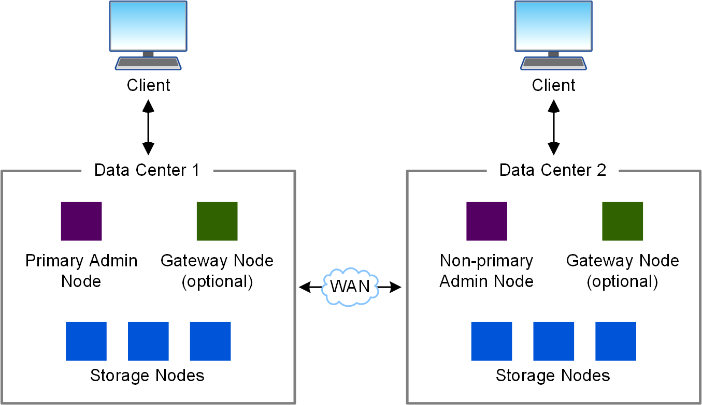

= Architecture StorageGRID et topologie réseau
:allow-uri-read: 
:icons: font
:imagesdir: ../media/

[role="lead"]
Un système StorageGRID se compose de plusieurs types de nœuds grid sur un ou plusieurs sites de data Center.

Voir la link:nodes-and-services.html["descriptions des types de nœuds de grille"].

Pour plus d'informations sur la topologie, les exigences et les communications de grille du réseau StorageGRID, reportez-vous au link:../network/index.html["Instructions de mise en réseau"].

== Topologies de déploiement

Le système StorageGRID peut être déployé sur un seul data Center ou sur plusieurs sites de data Center.

=== Sur un seul site

Dans un déploiement avec un site unique, l'infrastructure et les opérations du système StorageGRID sont centralisées.

image::../media/data_center_site_single.png[Un seul data Center site]

=== Sites multiples

Dans un déploiement sur plusieurs sites, il est possible d'installer différents types et quantités de ressources StorageGRID sur chaque site. Par exemple, un data Center peut nécessiter plus de stockage qu'un autre.

Différents sites sont souvent situés dans des emplacements géographiques différents dans différents domaines de défaillance, tels qu'une ligne de défaut sismique ou une inondation. Le partage des données et la reprise après incident sont réalisés par la distribution automatisée des données vers d'autres sites.

Plusieurs sites logiques peuvent également exister au sein d'un même data Center, afin de permettre l'utilisation de la réplication distribuée et du codage d'effacement pour améliorer la disponibilité et la résilience.

=== Redondance des nœuds du grid

Dans un déploiement sur un ou plusieurs sites, vous pouvez éventuellement inclure plusieurs nœuds d'administration ou nœuds de passerelle afin d'assurer la redondance. Par exemple, vous pouvez installer plusieurs nœuds d'administration sur un seul site ou sur plusieurs sites. Cependant, chaque système StorageGRID ne peut avoir qu'un seul nœud d'administration principal.

== Architecture du système

Ce schéma montre comment les nœuds grid sont organisés dans un système StorageGRID.

image::../media/grid_nodes_and_components.png[schéma décrit par le texte environnant]

Les clients S3 stockent et récupèrent des objets dans StorageGRID. D'autres clients sont utilisés pour envoyer des notifications par e-mail, pour accéder à l'interface de gestion StorageGRID et éventuellement pour accéder au partage d'audit.

Les clients S3 peuvent se connecter à un nœud de passerelle ou à un nœud d'administration pour utiliser l'interface d'équilibrage de la charge avec les nœuds de stockage. Les clients S3 peuvent également se connecter directement aux nœuds de stockage via HTTPS.

Les objets peuvent être stockés dans StorageGRID sur des nœuds de stockage logiciels ou matériels, ou dans des pools de stockage cloud, composés de compartiments S3 externes ou de conteneurs de stockage Azure Blob.
