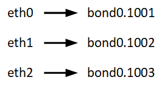

= Exigences de migration des conteneurs Node (Linux)
:allow-uri-read: 
:icons: font
:imagesdir: ../media/

[role="lead"]
La fonction de migration de nœud vous permet de déplacer manuellement un nœud d'un hôte à un autre. En général, les deux hôtes se trouvent dans le même data Center physique.

NOTE: « Linux » fait référence à un déploiement RHEL, Ubuntu ou Debian.  Pour une liste des versions prises en charge, consultez le https://imt.netapp.com/matrix/#welcome["Matrice d'interopérabilité NetApp (IMT)"^] .

La migration des nœuds vous permet d'effectuer la maintenance des hôtes physiques sans interrompre les opérations de la grille. Vous déplacez tous les nœuds StorageGRID, un par un, vers un autre hôte avant de mettre l'hôte physique hors ligne. La migration de nœuds ne demande qu'une interruption courte pour chaque nœud et ne doit en aucun cas affecter le fonctionnement ou la disponibilité des services de grid.

Pour utiliser la fonctionnalité de migration de nœuds StorageGRID, votre déploiement doit répondre à des exigences supplémentaires :

* Noms d'interface réseau cohérents entre les hôtes dans un seul data Center physique
* Stockage partagé pour les métadonnées StorageGRID et les volumes de référentiel d'objets accessibles par tous les hôtes dans un seul data Center physique. Vous pouvez, par exemple, utiliser des baies de stockage NetApp E-Series.

Si vous utilisez des hôtes virtuels et que la couche de l'hyperviseur sous-jacent prend en charge la migration des ordinateurs virtuels, vous pouvez utiliser cette fonctionnalité à la place de la fonctionnalité de migration des nœuds de StorageGRID. Dans ce cas, vous pouvez ignorer ces exigences supplémentaires.

Avant d'effectuer la migration ou la maintenance de l'hyperviseur, arrêtez les nœuds selon les besoins. Voir les instructions pour link:../maintain/shutting-down-grid-node.html["arrêt d'un nœud grid"].

== VMware Live migration non pris en charge

Lors d'une installation sans système d'exploitation sur des machines virtuelles VMware, OpenStack Live migration et VMware Live vMotion entraînent un bond de l'horloge de la machine virtuelle et ne sont pas pris en charge pour les nœuds de grid, quel qu'en soit le type. Bien que les temps d'horloge rares et incorrects peuvent entraîner une perte de données ou des mises à jour de la configuration.

La migration à froid est prise en charge. Dans le cadre d'une migration à froid, vous devez arrêter les nœuds StorageGRID avant de les migrer entre les hôtes. Voir les instructions pour link:../maintain/shutting-down-grid-node.html["arrêt d'un nœud grid"].

== Noms d'interface réseau cohérents

Pour déplacer un nœud d'un hôte à un autre, le service d'hôte StorageGRID doit être certain que la connectivité réseau externe du nœud à son emplacement actuel peut être dupliquée au nouvel emplacement. Cette confiance est obtenue grâce à l'utilisation de noms d'interface réseau cohérents dans les hôtes.

Supposons, par exemple, que le nœud StorageGRID exécutant sur Host1 ait été configuré avec les mappages d'interface suivants :

Le côté gauche des flèches correspond aux interfaces traditionnelles affichées à partir d'un conteneur StorageGRID (c'est-à-dire, respectivement, les interfaces réseau Grid, Admin et client). Le côté droit des flèches correspond aux interfaces hôtes réelles fournissant ces réseaux, qui sont trois interfaces VLAN subordonnées à la même liaison d'interface physique.

Supposons maintenant que vous voulez migrer NodeA vers Host2. Si Host2 possède également des interfaces nommées bond0.1001, bond0.1002, et bond0.1003, le système permettra le déplacement, en supposant que les interfaces nommées similaires fourniront la même connectivité sur Host2 que sur Host1. Si Host2 ne possède pas d'interfaces avec les mêmes noms, le déplacement ne sera pas autorisé.

Il existe de nombreuses façons d'obtenir une dénomination d'interface réseau cohérente sur plusieurs hôtes ; voir  pour quelques exemples.link:configuring-host-network.html["Configurez le réseau hôte"]

== Stockage partagé

Pour réaliser des migrations de nœuds rapides et sans surcharge, la fonctionnalité de migration de nœuds StorageGRID ne déplace pas physiquement les données du nœud. La migration des nœuds se déroule comme une paire d'opérations d'exportation et d'importation :

* Lors de l'opération d'exportation de nœud, une petite quantité de données d'état persistant est extraite du conteneur de nœud s'exécutant sur HostA et mise en cache sur le volume de données système de ce nœud. Ensuite, le conteneur de nœud sur HostA est déinstancié.
* Lors de l'opération d'importation de nœud, le conteneur de nœud sur l'hôte B qui utilise les mêmes mappages de mémoire de bloc et d'interface réseau qui étaient en vigueur sur l'hôte a est instancié. Les données de l'état persistant en cache sont ensuite insérées dans la nouvelle instance.

Compte tenu de ce mode de fonctionnement, toutes les données système et les volumes de stockage objet du nœud doivent être accessibles à la fois à HostA et HostB pour que la migration soit autorisée, et pour fonctionner. En outre, ils doivent avoir été mappés dans le noeud en utilisant des noms qui sont garantis pour faire référence aux mêmes LUN sur HostA et HostB.

L'exemple suivant montre une solution pour le mappage de périphériques en mode bloc pour un nœud de stockage StorageGRID, où les chemins d'accès multiples DM sont utilisés sur les hôtes, et le champ alias a été utilisé dans `/etc/multipath.conf` pour fournir des noms de périphériques en mode bloc cohérents et conviviaux disponibles sur tous les hôtes.

image::../media/block_device_mapping_rhel.gif[Mappage des périphériques de bloc]
