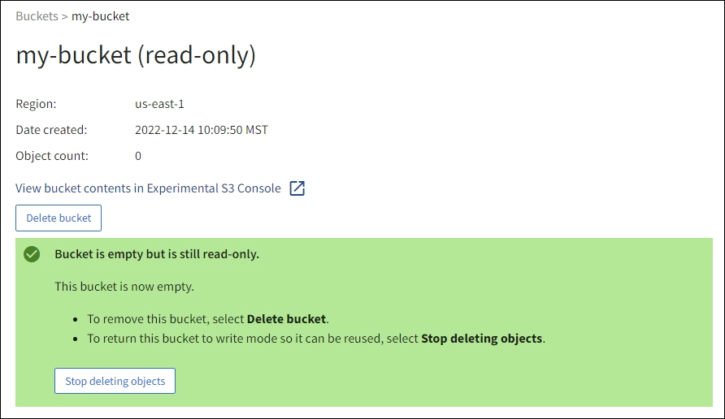

= Supprime les objets du compartiment
:allow-uri-read: 
:icons: font
:imagesdir: ../media/

[role="lead"]
Vous pouvez utiliser le Gestionnaire de locataires pour supprimer les objets d'une ou de plusieurs compartiments.

.Considérations et exigences
Avant d'effectuer ces étapes, notez les points suivants :

* Lorsque vous supprimez les objets d'un compartiment, StorageGRID supprime définitivement tous les objets et toutes les versions d'objets de chaque compartiment sélectionné de tous les nœuds et sites de votre système StorageGRID. StorageGRID supprime également les métadonnées d'objet associées. Vous ne pourrez pas récupérer ces informations.
* La suppression de tous les objets d'un compartiment peut prendre plusieurs minutes, jours, voire semaines, en fonction du nombre d'objets, de copies d'objet et d'opérations simultanées.
* Si un compartiment a link:using-s3-object-lock.html["Verrouillage objet S3 activé"], il peut rester à l'état *Suppression d'objets : lecture seule* pendant _années_.
+

TIP: Un compartiment qui utilise le verrouillage d'objet S3 restera à l'état *Suppression d'objets : lecture seule* jusqu'à ce que la date de conservation soit atteinte pour tous les objets et que toutes les mises en suspens légales soient supprimées.

* Pendant la suppression des objets, l'état du compartiment est *Suppression d'objets : lecture seule*. Dans cet état, vous ne pouvez pas ajouter de nouveaux objets au compartiment.
* Une fois tous les objets supprimés, le compartiment reste à l'état en lecture seule. Vous pouvez effectuer l'une des opérations suivantes :
+
** Ramener le compartiment en mode écriture et le réutiliser pour de nouveaux objets
** Supprimez le compartiment
** Conservez le compartiment en mode lecture seule pour réserver son nom pour une utilisation ultérieure

* Si la gestion des versions d'objet est activée dans un compartiment, les marqueurs de suppression créés dans StorageGRID 11.8 ou version ultérieure peuvent être supprimés à l'aide des opérations de suppression d'objets dans un compartiment.
* Si la gestion des versions d'objet est activée dans un compartiment, l'opération de suppression d'objets ne supprime pas les marqueurs de suppression créés dans StorageGRID 11.7 ou une version antérieure. Voir les informations sur la suppression d'objets dans un compartiment dans link:../ilm/how-objects-are-deleted.html#delete-s3-versioned-objects["Suppression d'objets avec version S3"].
* Si vous utilisez link:grid-federation-manage-cross-grid-replication.html["réplication entre plusieurs grilles"], notez ce qui suit :
+
** L'utilisation de cette option ne supprime aucun objet du compartiment de l'autre grille.
** Si vous sélectionnez cette option pour le compartiment source, l'alerte *échec de réplication multigrille* est déclenchée si vous ajoutez des objets au compartiment de destination sur l'autre grille. Si vous ne pouvez pas garantir que personne n'ajoute d'objets au compartiment de l'autre grille avant de supprimer tous les objets link:../tenant/grid-federation-manage-cross-grid-replication.html["désactiver la réplication entre les grilles"]du compartiment.

.Avant de commencer
* Vous êtes connecté au gestionnaire de locataires à l'aide d'un link:../admin/web-browser-requirements.html["navigateur web pris en charge"].
* Vous appartenez à un groupe d'utilisateurs qui possède le link:tenant-management-permissions.html["Autorisation d'accès racine"]. Cette autorisation remplace les paramètres d'autorisations dans les stratégies de groupe ou de compartiment.

.Étapes
. Sélectionnez *Afficher les compartiments* dans le tableau de bord ou sélectionnez *STOCKAGE (S3)* > *compartiments*.
+
La page compartiments s'affiche et affiche tous les compartiments S3 existants.

. Utilisez le menu *actions* ou la page de détails pour un compartiment spécifique.
+
[role="tabbed-block"]
====
.Menu actions
--
.. Cochez la case correspondant à chaque compartiment dans lequel vous souhaitez supprimer des objets.
.. Sélectionnez *actions* > *Supprimer les objets dans le compartiment*.

--
.Page de détails
--
.. Sélectionnez un nom de compartiment pour afficher ses détails.
.. Sélectionnez *Supprimer les objets dans le compartiment*.

--
====
. Lorsque la boîte de dialogue de confirmation s'affiche, vérifiez les détails, entrez *Oui* et sélectionnez *OK*.
. Attendez que l'opération de suppression commence.
+
Au bout de quelques minutes :

+
** Une bannière d'état jaune s'affiche sur la page de détails du compartiment. La barre de progression représente le pourcentage d'objets supprimés.
** *(lecture seule)* apparaît après le nom du compartiment sur la page de détails du compartiment.
** *(Suppression d'objets : lecture seule)* apparaît à côté du nom du compartiment sur la page compartiments.

+
image::../media/delete-bucket-objects-in-progress.png[capture d'écran montrant la suppression d'objets de compartiment]

. Si nécessaire pendant l'exécution de l'opération, sélectionnez *Arrêter la suppression d'objets* pour arrêter le processus. Sélectionnez ensuite *Supprimer les objets dans le compartiment* pour reprendre le processus.
+
Lorsque vous sélectionnez *Arrêter la suppression d'objets*, le compartiment est remis en mode écriture ; cependant, vous ne pouvez pas accéder aux objets qui ont été supprimés ni les restaurer.

. Attendez la fin de l'opération.
+
Lorsque le compartiment est vide, la bannière d'état est mise à jour, mais le compartiment reste en lecture seule.

+

. Effectuez l'une des opérations suivantes :
+
** Quittez la page pour garder le compartiment en mode lecture seule. Par exemple, vous pouvez conserver un compartiment vide en mode lecture seule afin de réserver le nom du compartiment pour une utilisation ultérieure.
** Supprimer le compartiment. Vous pouvez sélectionner *Supprimer un compartiment* pour supprimer un seul compartiment ou retourner à la page compartiments et sélectionner *actions* > *Supprimer* compartiments pour supprimer plusieurs compartiments.
+

NOTE: Si vous ne pouvez pas supprimer un compartiment multiversion après la suppression de tous les objets, les marqueurs de suppression peuvent rester. Pour supprimer le godet, vous devez supprimer tous les marqueurs de suppression restants.

** Ramenez le compartiment en mode écriture et réutilisez-le éventuellement pour de nouveaux objets. Vous pouvez sélectionner *Arrêter la suppression d'objets* pour un seul compartiment ou revenir à la page compartiments et sélectionner *action* > *Arrêter la suppression d'objets* pour plusieurs compartiments.

