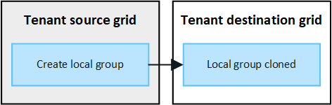

= Cloner des groupes de locataires et des utilisateurs
:allow-uri-read: 
:icons: font
:imagesdir: ../media/

[role="lead"]
Si un locataire a été créé ou modifié pour utiliser une connexion de fédération de grille, ce dernier est répliqué d'un système StorageGRID (le locataire source) vers un autre système StorageGRID (le locataire de réplica). Une fois le tenant répliqué, tous les groupes et utilisateurs ajoutés au tenant source sont clonés dans le tenant de réplica.

Le système StorageGRID dans lequel le tenant est créé à l'origine est _source GRID_ du tenant. Le système StorageGRID dans lequel le locataire est répliqué est la _grille de destination_ du locataire. Les deux comptes de tenant possèdent les mêmes ID de compte, nom, description, quota de stockage et autorisations attribuées, mais le locataire de destination ne dispose pas initialement d'un mot de passe utilisateur root. Pour plus de détails, voir link:../admin/grid-federation-what-is-account-clone.html["Qu'est-ce que le clone de compte"] et link:../admin/grid-federation-manage-tenants.html["Gérer les locataires autorisés"].

Le clonage des informations de compte de locataire est requis pour les link:../admin/grid-federation-what-is-cross-grid-replication.html["réplication entre plusieurs grilles"]objets de compartiment. Le fait de disposer des mêmes groupes de locataires et utilisateurs sur les deux grilles vous permet d'accéder aux compartiments et objets correspondants sur l'une ou l'autre grille.

== Workflow des locataires pour le clone de compte

Si votre compte de locataire dispose de l'autorisation *utiliser la connexion de fédération de grille*, consultez le diagramme de flux de travail pour voir les étapes à suivre pour cloner des groupes, des utilisateurs et des clés d'accès S3.

image::../media/grid-federation-account-clone-workflow-tm.png[workflow du locataire pour le clone du compte. Les étapes sont décrites dans le texte suivant.]

Voici les principales étapes du flux de travail :

.image:https://raw.githubusercontent.com/NetAppDocs/common/main/media/number-1.png["Une seule"] Connectez-vous au locataire
[role="quick-margin-para"]
Connectez-vous au compte de locataire sur la grille source (la grille dans laquelle le locataire a été initialement créé).

.image:https://raw.githubusercontent.com/NetAppDocs/common/main/media/number-2.png["Deux"] Vous pouvez également configurer la fédération des identités
[role="quick-margin-para"]
Si votre compte de tenant dispose de l'autorisation *utiliser son propre référentiel d'identité* pour utiliser des groupes et des utilisateurs fédérés, configurez le même référentiel d'identité (avec les mêmes paramètres) pour les comptes de tenant source et de destination. Les groupes et utilisateurs fédérés ne peuvent pas être clonés à moins que les deux grilles n'utilisent le même référentiel d'identité. Pour obtenir des instructions, reportez-vous à la section link:using-identity-federation.html["Utiliser la fédération des identités"].

.image:https://raw.githubusercontent.com/NetAppDocs/common/main/media/number-3.png["Trois"] Créer des groupes et des utilisateurs
[role="quick-margin-para"]
Lorsque vous créez des groupes et des utilisateurs, commencez toujours par la grille source du locataire. Lorsque vous ajoutez un nouveau groupe, StorageGRID le clone automatiquement dans la grille de destination.

[role="quick-margin-list"]
* Si la fédération des identités est configurée pour l'ensemble du système StorageGRID ou pour votre compte de locataire, link:creating-groups-for-s3-tenant.html["créer de nouveaux groupes de locataires"] en important des groupes fédérés à partir du référentiel d'identité.

[role="quick-margin-list"]
* Si vous n'utilisez pas la fédération d'identité,link:creating-groups-for-s3-tenant.html["créer de nouveaux groupes locaux"] et puislink:manage-users.html["créer des utilisateurs locaux"] .

.image:https://raw.githubusercontent.com/NetAppDocs/common/main/media/number-4.png["Quatre"] Création de clés d'accès S3
[role="quick-margin-para"]
Vous pouvez link:creating-your-own-s3-access-keys.html["créez vos propres clés d'accès"] ou link:creating-another-users-s3-access-keys.html["créez les clés d'accès d'un autre utilisateur"]sur la grille source ou la grille de destination pour accéder aux compartiments de cette grille.

.image:https://raw.githubusercontent.com/NetAppDocs/common/main/media/number-5.png["Cinq"] Vous pouvez également cloner les clés d'accès S3
[role="quick-margin-para"]
Si vous avez besoin d'accéder à des compartiments avec les mêmes clés d'accès sur les deux grilles, créez les clés d'accès sur la grille source, puis utilisez l'API du gestionnaire de locataires pour les cloner manuellement dans la grille de destination. Pour obtenir des instructions, reportez-vous à la section link:../tenant/grid-federation-clone-keys-with-api.html["Cloner les clés d'accès S3 à l'aide de l'API"].

== Comment les groupes, les utilisateurs et les clés d'accès S3 sont-ils clonés ?

Dans cette section, vous apprendrez comment les groupes, les utilisateurs et les clés d'accès S3 sont clonés entre la grille source des locataires et la grille de destination des locataires.

=== Les groupes locaux créés dans la grille source sont clonés

Une fois qu'un compte de locataire est créé et répliqué sur la grille de destination, StorageGRID clone automatiquement tous les groupes locaux que vous ajoutez à la grille source du locataire dans la grille de destination du locataire.

Le groupe d'origine et le clone disposent des mêmes mode d'accès, autorisations de groupe et règles de groupe S3. Pour obtenir des instructions, reportez-vous à la section link:creating-groups-for-s3-tenant.html["Créez des groupes pour les locataires S3"].

NOTE: Tous les utilisateurs sélectionnés lors de la création d'un groupe local sur la grille source ne sont pas inclus lorsque le groupe est cloné dans la grille de destination. Pour cette raison, ne sélectionnez pas d'utilisateurs lorsque vous créez le groupe. Sélectionnez plutôt le groupe lorsque vous créez les utilisateurs.

=== Les utilisateurs locaux créés dans la grille source sont clonés

Lorsque vous créez un nouvel utilisateur local sur la grille source, StorageGRID clone automatiquement cet utilisateur sur la grille de destination.  L'utilisateur d'origine et son clone ont le même nom complet, le même nom d'utilisateur et le même paramètre *Refuser l'accès*.  Les deux utilisateurs appartiennent également aux mêmes groupes. Pour les instructions, voirlink:manage-users.html["Gérer les utilisateurs"] .

Pour des raisons de sécurité, les mots de passe des utilisateurs locaux ne sont pas clonés dans la grille de destination.  Si un utilisateur local doit accéder à Tenant Manager sur la grille de destination, l'utilisateur root du compte locataire doit ajouter un mot de passe pour cet utilisateur sur la grille de destination. Pour les instructions, voirlink:manage-users.html["Gérer les utilisateurs"] .

image::../media/grid-federation-local-user-clone.png[image montrant que les utilisateurs locaux sont clonés de la grille source à la grille de destination]

=== Les groupes fédérés créés dans la grille source sont clonés

En supposant que les conditions d'utilisation du clone de compte link:../admin/grid-federation-what-is-account-clone.html#account-clone-sso["authentification unique"] link:../admin/grid-federation-what-is-account-clone.html#account-clone-identity-federation["fédération des identités"]soient remplies, les groupes fédérés que vous créez (importez) pour le locataire sur la grille source sont automatiquement clonés dans le locataire de la grille de destination.

Les deux groupes disposent des mêmes mode d'accès, autorisations de groupe et règles de groupe S3.

Une fois les groupes fédérés créés pour le locataire source et clonés dans le locataire de destination, les utilisateurs fédérés peuvent se connecter au locataire dans l'une ou l'autre des grilles.

image::../media/grid-federation-federated-group-clone.png[image montrant que les groupes fédérés sont clonés de la grille source à la grille de destination]

=== Les clés d'accès S3 peuvent être clonées manuellement

StorageGRID ne clone pas automatiquement les clés d'accès S3, car la sécurité est améliorée grâce à l'utilisation de clés différentes sur chaque grid.

Pour gérer les clés d'accès sur les deux grilles, vous pouvez effectuer l'une des opérations suivantes :

* Si vous n'avez pas besoin d'utiliser les mêmes touches pour chaque grille, vous pouvez link:creating-your-own-s3-access-keys.html["créez vos propres clés d'accès"] ou link:creating-another-users-s3-access-keys.html["créez les clés d'accès d'un autre utilisateur"] sur chaque grille.
* Si vous devez utiliser les mêmes clés sur les deux grilles, vous pouvez créer des clés sur la grille source, puis utiliser l'API du gestionnaire de locataires pour accéder manuellement link:../tenant/grid-federation-clone-keys-with-api.html["cloner les clés"] à la grille de destination.

image::../media/grid-federation-s3-access-key.png[image montrant que les clés d'accès s3 peuvent être clonées entre la grille source et la grille de destination]

NOTE: Lorsque vous clonez les clés d'accès S3 d'un utilisateur fédéré, ces deux clés sont clonées dans le locataire de destination.

=== Les groupes et utilisateurs ajoutés à la grille de destination ne sont pas clonés

Le clonage s'effectue uniquement depuis la grille source du locataire vers la grille de destination du locataire. Si vous créez ou importez des groupes et des utilisateurs sur la grille de destination du locataire, StorageGRID ne les clonez pas dans la grille source du locataire.

image::../media/grid-federation-account-not-cloned.png[image montrant que les détails de la grille de destination ne sont pas clonés dans la grille source]

=== Les groupes, utilisateurs et clés d'accès modifiés ou supprimés ne sont pas clonés

Le clonage a lieu uniquement lorsque vous créez de nouveaux groupes et utilisateurs.

Si vous modifiez ou supprimez des groupes, des utilisateurs ou des clés d'accès sur l'une ou l'autre grille, vos modifications ne seront pas clonées sur l'autre grille.

image::../media/grid-federation-account-clone-edit-delete.png[l'image montrant que les détails modifiés ou supprimés ne sont pas clonés]
