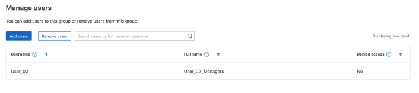

= Gérer les groupes
:allow-uri-read: 
:icons: font
:imagesdir: ../media/

[role="lead"]
Gérez vos groupes de locataires selon vos besoins pour afficher, modifier ou dupliquer un groupe, etc.

.Avant de commencer
* Vous êtes connecté au gestionnaire de locataires à l'aide d'un link:../admin/web-browser-requirements.html["navigateur web pris en charge"].
* Vous appartenez à un groupe d'utilisateurs qui possède le link:tenant-management-permissions.html["Autorisation d'accès racine"].

== Afficher ou modifier un groupe

Vous pouvez afficher et modifier les informations de base et les détails de chaque groupe.

.Étapes
. Sélectionnez *ACCESS MANAGEMENT* > *Groups*.
. Consultez les informations fournies sur la page groupes, qui répertorie les informations de base pour tous les groupes locaux et fédérés pour ce compte de tenant.
+
Si le compte de tenant dispose de l'autorisation *utiliser la connexion de fédération de grille* et que vous affichez des groupes sur la grille source du locataire :

+
** Un message de bannière indique que si vous modifiez ou supprimez un groupe, vos modifications ne seront pas synchronisées avec l'autre grille.
** Si nécessaire, un message de bannière indique si les groupes n'ont pas été clonés dans le locataire sur la grille de destination. Vous pouvez <<clone-groups,réessayez un clone de groupe>> que cela a échoué.

. Si vous souhaitez modifier le nom du groupe :
+
.. Cochez la case du groupe.
.. Sélectionnez *actions* > *Modifier le nom du groupe*.
.. Saisissez le nouveau nom.
.. Sélectionnez *Enregistrer les modifications.*

. Si vous souhaitez afficher plus de détails ou apporter des modifications supplémentaires, effectuez l'une des opérations suivantes :
+
** Sélectionnez le nom du groupe.
** Cochez la case du groupe et sélectionnez *actions* > *Afficher les détails du groupe*.

. Consultez la section Présentation, qui présente les informations suivantes pour chaque groupe :
+
** Nom d'affichage
** Nom unique
** Type
** Mode d'accès
** Autorisations
** Règle S3
** Nombre d'utilisateurs dans ce groupe
** Champs supplémentaires si le compte de tenant dispose de l'autorisation *utiliser la connexion de fédération de grille* et que vous affichez le groupe sur la grille source du locataire :
+
*** État de clonage, soit *succès* soit *échec*
*** Une bannière bleue indiquant que si vous modifiez ou supprimez ce groupe, vos modifications ne seront pas synchronisées avec l'autre grille.

. Modifiez les paramètres de groupe selon vos besoins. Voir link:creating-groups-for-s3-tenant.html["Créez des groupes pour un locataire S3"] et link:creating-groups-for-swift-tenant.html["Créez des groupes pour un locataire Swift"] pour plus de détails sur ce que vous devez saisir.
+
.. Dans la section vue d'ensemble, modifiez le nom d'affichage en sélectionnant le nom ou l'icône d'édition image:../media/icon_edit_tm.png["Icône Modifier"].
.. Dans l'onglet *autorisations de groupe*, mettez à jour les autorisations et sélectionnez *Enregistrer les modifications*.
.. Dans l'onglet *Stratégie de groupe*, apportez les modifications nécessaires et sélectionnez *Enregistrer les modifications*.
+
*** Si vous modifiez un groupe S3, sélectionnez une règle de groupe S3 différente ou entrez la chaîne JSON pour une règle personnalisée, si nécessaire.
*** Si vous modifiez un groupe Swift, cochez ou décochez la case *Administrateur Swift*.

. Pour ajouter un ou plusieurs utilisateurs locaux existants au groupe :
+
.. Sélectionnez l'onglet utilisateurs.
+

.. Sélectionnez *Ajouter des utilisateurs*.
.. Sélectionnez les utilisateurs existants que vous souhaitez ajouter, puis sélectionnez *Ajouter des utilisateurs*.
+
Un message de réussite s'affiche en haut à droite.

. Pour supprimer des utilisateurs locaux du groupe :
+
.. Sélectionnez l'onglet utilisateurs.
.. Sélectionnez *Supprimer utilisateurs*.
.. Sélectionnez les utilisateurs que vous souhaitez supprimer, puis sélectionnez *Supprimer utilisateurs*.
+
Un message de réussite s'affiche en haut à droite.

. Confirmez que vous avez sélectionné *Enregistrer les modifications* pour chaque section que vous avez modifiée.

== Dupliquer le groupe

Vous pouvez dupliquer un groupe existant pour créer de nouveaux groupes plus rapidement.

NOTE: Si votre compte de locataire dispose de l'autorisation *utiliser la connexion de fédération de grille* et que vous dupliquez un groupe à partir de la grille source du locataire, le groupe dupliqué sera cloné dans la grille de destination du locataire.

.Étapes
. Sélectionnez *ACCESS MANAGEMENT* > *Groups*.
. Cochez la case du groupe que vous souhaitez dupliquer.
. Sélectionnez *actions* > *Dupliquer le groupe*.
. Voir link:creating-groups-for-s3-tenant.html["Créez des groupes pour un locataire S3"] ou link:creating-groups-for-swift-tenant.html["Créez des groupes pour un locataire Swift"] pour plus de détails sur ce que vous devez saisir.
. Sélectionnez *Créer groupe*.

== [[clone-groups]]Réessayez le clone de groupe

Pour réessayer un clone qui a échoué :

. Sélectionnez chaque groupe indiquant _(échec du clonage)_ sous le nom du groupe.
. Sélectionnez *actions* > *groupes de clones*.
. Consultez l'état de l'opération de clonage dans la page de détails de chaque groupe que vous êtes en train de cloner.

Pour plus d'informations, voir link:grid-federation-account-clone.html["Cloner des groupes de locataires et des utilisateurs"].

== Supprimer un ou plusieurs groupes

Vous pouvez supprimer un ou plusieurs groupes. Les utilisateurs qui appartiennent uniquement à un groupe supprimé ne pourront plus se connecter au gestionnaire de tenant ni utiliser le compte de tenant.

NOTE: Si votre compte de locataire dispose de l'autorisation *utiliser la connexion de fédération de grille* et que vous supprimez un groupe, StorageGRID ne supprimera pas le groupe correspondant sur l'autre grille. Si vous devez conserver ces informations synchronisées, vous devez supprimer le même groupe des deux grilles.

.Étapes
. Sélectionnez *ACCESS MANAGEMENT* > *Groups*.
. Cochez la case correspondant à chaque groupe à supprimer.
. Sélectionnez *actions* > *Supprimer groupe* ou *actions* > *Supprimer groupes*.
+
Une boîte de dialogue de confirmation s'affiche.

. Sélectionnez *Supprimer le groupe* ou *Supprimer les groupes*.

