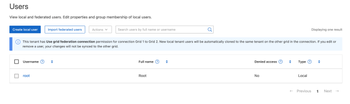

= Gérer les utilisateurs
:allow-uri-read: 
:icons: font
:imagesdir: ../media/

[role="lead"]
Vous pouvez créer des utilisateurs locaux et les affecter à des groupes locaux pour déterminer les fonctionnalités auxquelles ces utilisateurs peuvent accéder.  Vous pouvez également importer des utilisateurs fédérés.  Le gestionnaire de locataires comprend un utilisateur local prédéfini, nommé « root ».  Bien que vous puissiez ajouter et supprimer des utilisateurs locaux, vous ne pouvez pas supprimer l'utilisateur root.

NOTE: Si l'authentification unique (SSO) est activée pour votre système StorageGRID, les utilisateurs locaux ne pourront pas se connecter au gestionnaire de locataires ou à l'API de gestion des locataires, bien qu'ils puissent utiliser des applications clientes pour accéder aux ressources du locataire, en fonction des autorisations de groupe.

.Avant de commencer
* Vous êtes connecté au gestionnaire de locataires à l'aide d'un link:../admin/web-browser-requirements.html["navigateur web pris en charge"].
* Vous appartenez à un groupe d'utilisateurs qui possède le link:tenant-management-permissions.html["Autorisation d'accès racine"].
* Si votre compte de locataire dispose de l'autorisation *utiliser la connexion de fédération de grille*, vous avez examiné le flux de travail et les considérations pour link:grid-federation-account-clone.html["clonage de groupes de locataires et d'utilisateurs"]et vous êtes connecté à la grille source du locataire.

== [[create-user]]Créez un utilisateur local

Vous pouvez créer un utilisateur local et l'affecter à un ou plusieurs groupes locaux pour contrôler leurs autorisations d'accès.

Les utilisateurs S3 qui n'appartiennent à aucun groupe ne disposent pas d'autorisations de gestion ni de règles de groupe S3 qui leur sont appliquées. Il est possible que les utilisateurs bénéficient d'un accès par compartiment S3 accordé via une règle de compartiment.

=== Accédez à l'assistant de création d'utilisateur

.Étapes
. Sélectionnez *Gestion des accès* > *Utilisateurs*.
+
Si votre compte de locataire dispose de l'autorisation *utiliser la connexion de fédération de grille*, une bannière bleue indique qu'il s'agit de la grille source du locataire. Tous les utilisateurs locaux que vous créez sur cette grille seront clonés dans l'autre grille de la connexion.

+

. Sélectionnez *Créer utilisateur*.

=== Entrez les informations d'identification

.Étapes
. Pour l'étape *entrer les informations d'identification de l'utilisateur*, renseignez les champs suivants.
+
[cols="1a,3a"]
|===
| Champ | Description 

 a| 
Nom complet
 a| 
Le nom complet de cet utilisateur, par exemple le prénom et le nom d'une personne ou le nom d'une application.

 a| 
Nom d'utilisateur
 a| 
Le nom que cet utilisateur utilisera pour se connecter. Les noms d'utilisateur doivent être uniques et ne peuvent pas être modifiés.

*Remarque* : si votre compte locataire dispose de l'autorisation *utiliser la connexion de fédération de grille*, une erreur de clonage se produit si le même *Nom d'utilisateur* existe déjà pour le locataire sur la grille de destination.

 a| 
Mot de passe et confirmer le mot de passe
 a| 
Le mot de passe que l'utilisateur utilisera lors de sa connexion.

 a| 
Refuser l'accès
 a| 
Sélectionnez *Oui* pour empêcher cet utilisateur de se connecter au compte de tenant, même s'il appartient toujours à un ou plusieurs groupes.

Par exemple, sélectionnez *Oui* pour suspendre temporairement la capacité d'un utilisateur à se connecter.

|===
. Sélectionnez *Continuer*.

=== Affecter à des groupes

.Étapes
. Attribuez l'utilisateur à un ou plusieurs groupes locaux pour déterminer les tâches qu'ils peuvent effectuer.
+
L'attribution d'un utilisateur à des groupes est facultative. Si vous le souhaitez, vous pouvez sélectionner des utilisateurs lorsque vous créez ou modifiez des groupes.

+
Les utilisateurs qui n'appartiennent à aucun groupe ne disposent d'aucune autorisation de gestion. Les autorisations sont cumulatives. Les utilisateurs disposent de toutes les autorisations pour tous les groupes auxquels ils appartiennent. Voir link:tenant-management-permissions.html["Autorisations de gestion des locataires"].

. Sélectionnez *Créer utilisateur*.
+
Si votre compte locataire dispose de l'autorisation *utiliser la connexion de fédération de grille* et que vous êtes sur la grille source du locataire, le nouvel utilisateur local est cloné dans la grille de destination du locataire. *Succès* apparaît comme l'état *clonage* dans la section vue d'ensemble de la page de détails de l'utilisateur.

. Sélectionnez *Terminer* pour revenir à la page utilisateurs.

== Afficher ou modifier un utilisateur local

.Étapes
. Sélectionnez *Gestion des accès* > *Utilisateurs*.
. Consultez les informations fournies sur la page utilisateurs, qui répertorie les informations de base pour tous les utilisateurs locaux et fédérés pour ce compte de tenant.
+
Si le compte de tenant dispose de l'autorisation *utiliser la connexion de fédération de grille* et que vous affichez l'utilisateur sur la grille source du locataire :

+
** Un message de bannière indique que si vous modifiez ou supprimez un utilisateur, vos modifications ne seront pas synchronisées avec l'autre grille.
** Si nécessaire, un message de bannière indique si les utilisateurs n'ont pas été clonés dans le locataire sur la grille de destination. Vous pouvez <<clone-users,réessayez un clone utilisateur qui a échoué>>.

. Si vous souhaitez modifier le nom complet de l'utilisateur :
+
.. Cochez la case de l'utilisateur.
.. Sélectionnez *actions* > *Modifier le nom complet*.
.. Saisissez le nouveau nom.
.. Sélectionnez *Enregistrer les modifications.*

. Si vous souhaitez afficher plus de détails ou apporter des modifications supplémentaires, effectuez l'une des opérations suivantes :
+
** Sélectionnez le nom d'utilisateur.
** Cochez la case de l'utilisateur et sélectionnez *actions* > *Afficher les détails de l'utilisateur*.

. Consultez la section Présentation, qui présente les informations suivantes pour chaque utilisateur :
+
** Nom complet
** Nom d'utilisateur
** Type d'utilisateur
** Accès refusé
** Mode d'accès
** Appartenance à un groupe
** Champs supplémentaires si le compte de tenant dispose de l'autorisation *utiliser la connexion de fédération de grille* et que vous affichez l'utilisateur sur la grille source du locataire :
+
*** État de clonage, soit *succès* soit *échec*
*** Une bannière bleue indiquant que si vous modifiez cet utilisateur, vos modifications ne seront pas synchronisées avec l'autre grille.

. Modifiez les paramètres utilisateur selon vos besoins. Voir <<create-user,Créer un utilisateur local>> pour plus de détails sur ce que vous devez saisir.
+
.. Dans la section vue d'ensemble, modifiez le nom complet en sélectionnant le nom ou l'icône d'édition image:../media/icon_edit_tm.png["Icône Modifier"].
+
Vous ne pouvez pas modifier le nom d'utilisateur.

.. Dans l'onglet *Mot de passe*, modifiez le mot de passe de l'utilisateur et sélectionnez *Enregistrer les modifications*.
.. Dans l'onglet *accès*, sélectionnez *non* pour permettre à l'utilisateur de se connecter ou sélectionnez *Oui* pour empêcher l'utilisateur de se connecter. Ensuite, sélectionnez *Enregistrer les modifications*.
.. Dans l'onglet *clés d'accès*, sélectionnez *Créer une clé* et suivez les instructions pour link:creating-another-users-s3-access-keys.html["Création des clés d'accès S3 d'un autre utilisateur"].
.. Dans l'onglet *groupes*, sélectionnez *Modifier les groupes* pour ajouter l'utilisateur à des groupes ou supprimer l'utilisateur des groupes. Sélectionnez ensuite *Enregistrer les modifications*.

. Confirmez que vous avez sélectionné *Enregistrer les modifications* pour chaque section que vous avez modifiée.

== Importer des utilisateurs fédérés

Vous pouvez importer un ou plusieurs utilisateurs fédérés, jusqu'à un maximum de 100 utilisateurs, directement dans la page Utilisateurs.

.Étapes
. Sélectionnez *Gestion des accès* > *Utilisateurs*.
. Sélectionnez *Importer les utilisateurs fédérés*.
. Saisissez l'UUID ou le nom d'utilisateur d'un ou plusieurs utilisateurs fédérés.
+
Pour plusieurs entrées, ajoutez chaque UUID ou nom d'utilisateur sur une nouvelle ligne.

. Sélectionnez *Importer*.
+
Si l’importation dans le champ Utilisateurs échoue pour un ou plusieurs utilisateurs, procédez comme suit :

+
.. Développez *Utilisateurs non importés* et sélectionnez *Copier les utilisateurs*.
.. Réessayez l'importation en sélectionnant *Précédent* et en collant les utilisateurs copiés dans la boîte de dialogue *Importer les utilisateurs fédérés*.

+
Après avoir fermé la boîte de dialogue *Importer les utilisateurs fédérés*, les informations sur les utilisateurs fédérés s'affichent sur la page Utilisateurs pour les utilisateurs importés avec succès.

== Dupliquer l'utilisateur local

Vous pouvez dupliquer un utilisateur local pour créer un nouvel utilisateur plus rapidement.

NOTE: Si votre compte locataire dispose de l'autorisation *utiliser la connexion de fédération de grille* et que vous dupliquez un utilisateur de la grille source du locataire, l'utilisateur dupliqué sera cloné dans la grille de destination du locataire.

.Étapes
. Sélectionnez *Gestion des accès* > *Utilisateurs*.
. Cochez la case correspondant à l'utilisateur que vous souhaitez dupliquer.
. Sélectionnez *actions* > *Dupliquer utilisateur*.
. Voir <<create-user,Créer un utilisateur local>> pour plus de détails sur ce que vous devez saisir.
. Sélectionnez *Créer utilisateur*.

== [[clone-users]]Réessayez le clone utilisateur

Pour réessayer un clone qui a échoué :

. Sélectionnez chaque utilisateur qui indique _(échec du clonage)_ sous le nom d'utilisateur.
. Sélectionnez *actions* > *Cloner les utilisateurs*.
. Consultez l'état de l'opération de clonage sur la page de détails de chaque utilisateur que vous êtes en train de cloner.

Pour plus d'informations, voir link:grid-federation-account-clone.html["Cloner des groupes de locataires et des utilisateurs"].

== Supprimez un ou plusieurs utilisateurs locaux

Vous pouvez supprimer définitivement un ou plusieurs utilisateurs locaux qui n'ont plus besoin d'accéder au compte de locataire StorageGRID.

NOTE: Si votre compte de tenant dispose de l'autorisation *utiliser la connexion de fédération de grille* et que vous supprimez un utilisateur local, StorageGRID ne supprimera pas l'utilisateur correspondant sur l'autre grille. Si vous devez conserver ces informations synchronisées, vous devez supprimer le même utilisateur des deux grilles.

NOTE: Vous devez utiliser le référentiel d'identité fédéré pour supprimer des utilisateurs fédérés.

.Étapes
. Sélectionnez *Gestion des accès* > *Utilisateurs*.
. Cochez la case correspondant à chaque utilisateur à supprimer.
. Sélectionnez *actions* > *Supprimer utilisateur* ou *actions* > *Supprimer utilisateurs*.
+
Une boîte de dialogue de confirmation s'affiche.

. Sélectionnez *Supprimer utilisateur* ou *Supprimer utilisateurs*.

