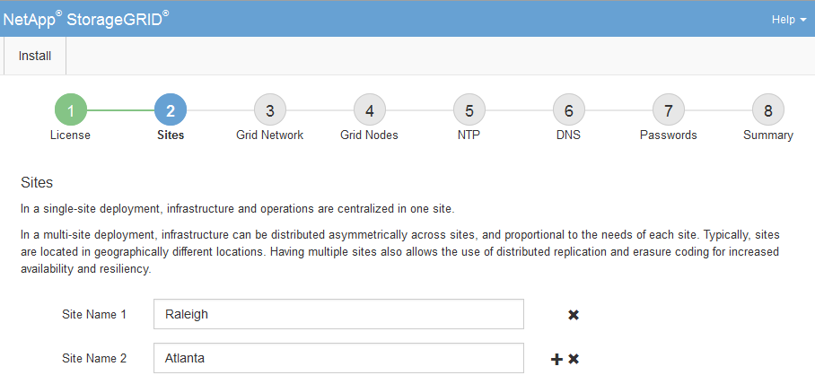

= Ajouter des sites
:allow-uri-read: 
:icons: font
:imagesdir: ../media/

[role="lead"]
Vous devez créer au moins un site lorsque vous installez StorageGRID. Vous pouvez créer des sites supplémentaires pour augmenter la fiabilité et la capacité de stockage de votre système StorageGRID.

.Étapes
. Sur la page sites, saisissez *Nom du site*.
. Pour ajouter d'autres sites, cliquez sur le signe plus en regard de la dernière entrée du site et entrez le nom dans la zone de texte Nouveau *Nom du site*.
+
Ajoutez autant de sites supplémentaires que nécessaire pour votre topologie de grille. Vous pouvez ajouter jusqu'à 16 sites.

+

. Cliquez sur *Suivant*.

